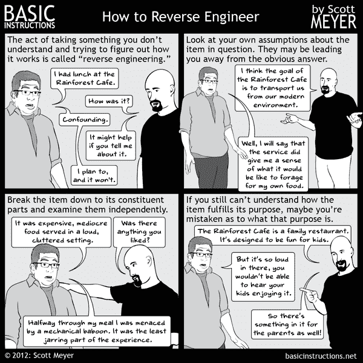

# 写给每个人的逆向工程

> 原文:[https://0xinfection.github.io/reversing/](https://0xinfection.github.io/reversing/)

#### — 由 [@mytechnotalent](https://twitter.com/mytechnotalent)

### 等等，什么是逆向工程？

维基百科将其定义为:

> 逆向工程，也称为逆向工程或反向工程，是一个过程，通过该过程，一个人工对象被解构，以揭示其设计，架构，代码，或从对象中提取知识。它类似于科学研究，唯一的区别是科学研究是作为一种自然现象进行的。

Whew, that was quite a mouthful, wasn't it? Well, it is one of the main reasons why this tutorial set exists. To make reverse engineering *as simple as possible.*

这套全面的逆向工程教程涵盖了 x86、x64 以及 32 位 ARM 和 64 位架构。如果你是一个想学习倒车的新手，或者只是想复习一些概念，你来对地方了。作为初学者，这些教程将带你从零开始，直到逆向工程的中级基础，这是网络安全领域的每个人都应该拥有的技能。如果您在这里只是为了刷新一些概念，您可以方便地使用侧栏来查看到目前为止已经讨论过的部分。

你可以得到 PDF 或 MOBI 格式的整个教程集。所有这些电子书版本都会随着新教程的加入而自动更新。

在这里下载:[ [PDF](reversing-for-everyone.pdf) | [MOBI](reversing-for-everyone.mobi)

由 [@0xInfection](https://twitter.com/0xInfection) 与♡制作的 Gitbook