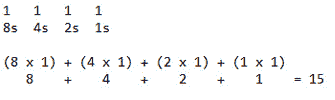

# 第 5 部分:二进制数系统

> 原文：<https://0xinfection.github.io/reversing/pages/part-5-binary-number-system.html>

如需所有课程的完整目录，请点击下方，因为除了课程涵盖的主题之外，它还会为您提供每个课程的简介。[https://github . com/mytechnotalent/逆向工程-教程](https://github.com/mytechnotalent/Reverse-Engineering-Tutorial)

二进制数定义了计算机的核心。计算机中的一个位不是开就是关。一个比特要么通电，要么不通电。我们将在以后的教程中深入探讨这个问题。

迷惑不解，我们何去何从？

不要害怕！二进制数字系统在这里！重要的是要明白，在二进制中，每一列的值是其右侧列的两倍，并且在基数中只有两位数字恰好是 0 和 1。

在十进制中，以 10 为基数，比如说我们有 15 这个数，这意味着(1 x 10) + (5 x 1) = 15，因此 5 是这个数乘以 1，而 1 是这个数乘以 10。

二进制以类似的方式工作，但是我们现在指的是基数 2。同样的二进制数是 1111。举例说明:

二进制数很重要，因为用二进制数代替十进制数可以简化计算机和相关技术的设计。二进制数系统最简单的定义是一个仅使用两位数的编号系统，正如我们上面提到的，来表示计算机体系结构所需的数字，而不是使用数字 1 到 9 加 0 来表示。

在下一课中，我们将讨论十六进制数字系统。从这里开始只会变得更加令人兴奋！