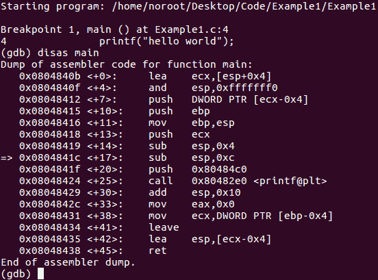
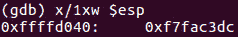

# 第 8 部分-字节、字、双字等...

> 原文:[https://0x infection . github . io/reversing/pages/part-8-bytes-words-double-words-etc . html](https://0xinfection.github.io/reversing/pages/part-8-bytes-words-double-words-etc.html)

如需所有课程的完整目录，请点击下方，因为除了课程涵盖的主题之外，它还会为您提供每个课程的简介。[https://github . com/mytechnotalent/逆向工程-教程](https://github.com/mytechnotalent/Reverse-Engineering-Tutorial)

内存以字节为单位。一个字节是 8 位。两个字节称为一个字，两个字称为双字，双字是四个字节(32 位)，四字是八个字节(64 位)。

一个字节是 8 位，是 256 的 2^8 次方。大小为 8 位的二进制数是从 0 到 255 的 256 个值中的一个。

计算机内存的每个字节都有自己唯一的地址。让我们通过在 main 函数上设置断点来回顾一下 Linux 中一个简单 hello world 应用程序的反汇编指令。我们将使用 GDB 调试器:

如果这还没有意义，不要担心。利用这个例子的目的是让你先睹为快，除了学习计算机中的内存，我们还将研究我们的第一个程序。

下面是对 ESP 寄存器的检查。同样，理解什么是寄存器或 ESP 做什么并不重要。我们只是想看看内存位置是什么样的:

我们看到 0xffffd040 的存储位置，它当然是十六进制的。我们还看到 ESP 寄存器中的值是 0xf7fac3dc，也是十六进制的。

必须了解 0xffffd040 是 4 个字节，是一个双字。正如我们在第 6 部分:十六进制数字系统中所学的，每个十六进制数字是 4 位长，也称为半字节。在 0xffffd040 中，让我们看看 0 的最右边的数字。在本例中，0(十六进制)的长度为 4 位。如果我们看看 40(十六进制)，我们会看到它是一个字节长或 8 位长。如果我们看看 d040，我们有两个字节或一个字的长度。最后，ffffd040 是一个双字或 4 个字节，长度为 32 位。地址开头的 0x 表示它是一个十六进制值。

计算机程序只不过是存储在内存中的机器指令。32 位 CPU 从内存地址中取出一个双字。双字是从内存中读取并加载到 CPU 中的一行 4 个字节。一旦执行完毕，CPU 就从指令指针中取出内存中的下一条机器指令。

你们中的新人已经有了第一印象。如果你不知道这里发生了什么，不要气馁或沮丧。在以后的课程中，我们将慢慢来，通过几十个例子来分解每一步。重要的是你花时间检查每节课讨论的内容。如有任何问题，请随时在下面发表评论。

在下一篇教程中，我们将讨论 x86 架构的基础知识。