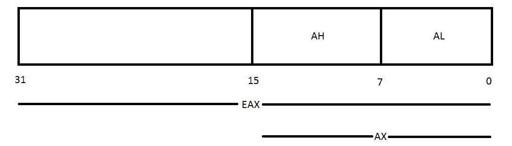
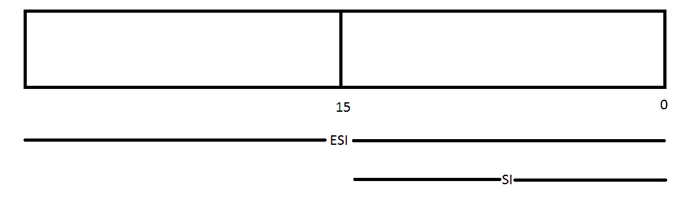

# 第 10 部分:通用寄存器

> 原文:[https://0x infection . github . io/reversing/pages/part-10-general-purpose-registers . html](https://0xinfection.github.io/reversing/pages/part-10-general-purpose-registers.html)

如需所有课程的完整目录，请点击下方，因为除了课程涵盖的主题之外，它还会为您提供每个课程的简介。[https://github . com/mytechnotalent/逆向工程-教程](https://github.com/mytechnotalent/Reverse-Engineering-Tutorial)

通用寄存器用于在处理器处理数据时临时存储数据。随着时间的推移，登记册发生了巨大的变化，并将继续变化。出于我们的目的，我们将重点关注 32 位 x86 体系结构。

每个新版本的通用寄存器都是为了向后兼容以前的处理器而创建的。这意味着在 8080 芯片上使用 8 位寄存器的代码仍然可以在今天的 64 位芯片组上运行。

通用寄存器可以用来保存任何类型的数据，其中一些已经获得了在程序中使用的特定用途。让我们回顾一下 IA-32 架构中的 8 个通用寄存器。

**EAX** :用于算术运算的主寄存器。也称为累加器，因为它保存算术运算的结果和函数返回值。

**EBX** :基址寄存器。指向 DS 段中数据的指针。用于存储程序的基址。

**ECX** :计数寄存器通常用来保存一个代表一个过程重复次数的值。用于循环和字符串操作。

EDX:一个通用寄存器。另外用于 I/O 操作。此外，将 EAX 扩展到 64 位。

**ESI** :源索引寄存器。指向 DS 寄存器指向的段中数据的指针。在字符串和数组操作中用作偏移地址。它保存从哪里读取数据的地址。

**EDI** :目的索引寄存器。指向 ES 寄存器指向的段中的数据(或目的地)的指针。在字符串和数组操作中用作偏移地址。它保存所有字符串操作的隐含写地址。

**EBP** :基准指针。指向堆栈上数据的指针(在 SS 段中)。它指向当前堆栈框架的底部。它用于引用局部变量。

**ESP** :堆栈指针(在 SS 段)。它指向当前堆栈帧的顶部。它用于引用局部变量。

请记住，上述每个寄存器的长度都是 32 位或 4 字节。EAX、EBX、ECX 和 EDX 寄存器的每个低 2 字节都可以由 AX 引用，然后由名称 AH、BH、ch 和 DH 细分为高字节，AL、BL、CL 和 DL 细分为低字节，每个字节 1 个字节。

此外，ESI、EDI、EBP 和 ESP 可以被它们的 16 位对等项引用，即 SI、DI、BP 和 SP。

对于没有学习过计算机工程的人来说，这可能有点令人困惑，但是让我在下表中举例说明:

EAX 将 AX 作为其 16 位段，然后您可以进一步将 AX 细分为低 8 位的 AL 和高 8 位的 AH。EBX、ECX 和 EDX 也是如此。EBX 将 BX 作为其 16 位段，然后您可以进一步将 BX 细分为低 8 位的 BL 和高 8 位的 BH。ECX 将 CX 作为其 16 位段，然后您可以进一步将 CX 细分为低 8 位的 CL 和高 8 位的 CH。EDX 将 DX 作为其 16 位段，然后您可以进一步将 DX 细分为低 8 位的 DL 和高 8 位的 DH。

ESI、EDI、EBP 和 ESP 可分为如下 16 位段:

ESI 将 SI 作为其 16 位段，EDI 将 DI 作为其 16 位段，EBP 将 BP 作为其 16 位段，ESP 将 SP 作为其 16 位段。

在下一个教程中，我们将继续讨论带有段寄存器的 IA-32 架构。