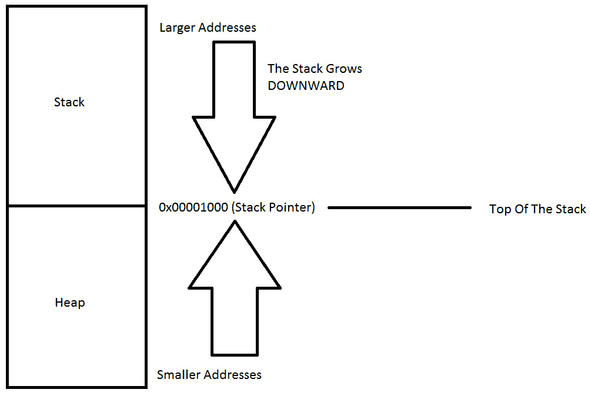

# 第 16 部分:堆

> 原文:[https://0x infection . github . io/reversing/pages/part-16-heap . html](https://0xinfection.github.io/reversing/pages/part-16-heap.html)

如需所有课程的完整目录，请点击下方，因为除了课程涵盖的主题之外，它还会为您提供每个课程的简介。[https://github . com/mytechnotalent/逆向工程-教程](https://github.com/mytechnotalent/Reverse-Engineering-Tutorial)

我们在基本恶意软件逆向工程部分的下一步关注堆。请记住，堆栈向下增长，堆向上增长。在我们未来的教程中，理解这个概念是非常非常重要的。

堆是计算机的内存区域，它不是自动为您管理的，也不是由 CPU 严格管理的。它是内存的自由浮动区域，大于内存的堆栈分配。

要在堆上分配内存，必须使用 **malloc()** 或者 **calloc()** ，这些都是内置的 C 函数。一旦你在堆上分配了内存，当你不再需要它的时候，你有责任通过使用 **free()** 来释放它。

如果不执行这一步，您的程序将会出现所谓的内存泄漏。也就是说，堆上的内存仍然会被留出，不会被其他需要它的进程使用。

与堆栈不同，堆对可变大小没有大小限制。唯一会限制堆的是计算机的物理限制。堆内存的读写速度稍慢，因为必须使用指针来访问堆上的内存。当我们深入 C 教程系列时，我们将演示这一点。

与堆栈不同，在堆上创建的变量可以被程序中任何地方的任何函数访问。堆变量本质上是全局的。

如果你需要为一个结构体或者一个大数组分配一个大的内存块，并且你需要在程序的很长一段时间内保持这个变量，并且这个变量必须被全局访问，那么你应该选择堆来实现这个目的。如果您需要像数组和结构这样可以动态改变大小的变量，比如可以根据需要增长或收缩的数组，那么您可能需要在堆上分配它们，并使用动态内存分配函数，如 **malloc()** 、 **calloc()** 、 **realloc()** 和 **free()** 来手动管理内存。

下一步是深入 Linux 环境下的 C 编程，我们一步一步地反汇编每个 C 程序，这样实际上您将学习 C 编程和汇编，这样您就可以在恶意软件分析和逆向工程方面提高技能。

我期待着下周与大家见面，届时我们将一步一步地全面讲解如何使用免费的 Virtual Box 软件工具在您当前的计算机上安装 Linux。