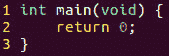
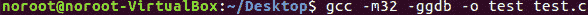
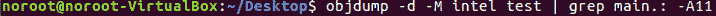
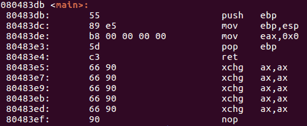

# 第 20 部分-指令代码处理

> 原文:[https://0x infection . github . io/reversing/pages/part-20-instruction-code-handling . html](https://0xinfection.github.io/reversing/pages/part-20-instruction-code-handling.html)

如需所有课程的完整目录，请点击下方，因为除了课程涵盖的主题之外，它还会为您提供每个课程的简介。[https://github . com/mytechnotalent/逆向工程-教程](https://github.com/mytechnotalent/Reverse-Engineering-Tutorial)

CPU 读取存储在内存中的指令代码，因为每个代码集可以包含一个或多个字节的信息，指导处理器执行非常具体的任务。当从存储器中读入每个指令代码时，指令代码所需的任何数据也被存储和读入存储器。

请记住，包含指令代码的内存与包含 CPU 使用的数据的字节没有什么不同，特殊指针用于帮助 CPU 跟踪数据在内存中的位置以及指令代码存储在哪里。

数据指针帮助 CPU 跟踪内存中数据区的起始位置，也就是堆栈。当新的数据元素被放入堆栈时，堆栈指针在内存中向下移动，当从堆栈中读取数据时，堆栈指针在内存中向上移动。如果您不理解这个概念，请复习第 15 部分——堆栈。

指令指针用于帮助 CPU 跟踪哪些指令代码已经被处理，以及接下来要处理哪些代码。如果你不理解这个概念，请复习第 12 部分——指令指针寄存器。

每个指令代码必须包括一个操作码，该操作码定义了将由 CPU 执行的基本功能或任务，操作码的长度在 1 到 3 字节之间，并且唯一地定义了所执行的功能。

让我们从一个简单的 C 程序 test.c 开始。

我们所做的就是创建一个整数类型的主函数，它有一个 void 参数并返回 0。这个程序所做的只是退出操作系统。

让我们编译并运行这个程序。

让我们使用 objdump 工具来查找其中的主函数。

下面是运行上述命令将得到的结果片段。下面是主函数的内容。请记住，下面是英特尔语法，我们在上一篇教程中谈到过。

最左边是相应的内存地址。中间是操作码，最后右边是相应的英特尔语法汇编语言。

为了简单起见，让我们检查一下内存地址 **80483de** ，在那里我们可以看到操作码 **b8 00 00 00 00** 。我们可以看到 **b8** 操作码对应右边的 **mov eax，0x0** 指令。下一系列 00 00 00 00 代表值 0 的 4 个字节。我们看到 **mov eax，0x0** 因此 0 的值被移入 eax，因此表示上面的代码。请记住，IA-32 平台使用我们称之为 little-endian 的符号，这意味着当从右向左阅读时，较低值的字节首先出现。

我想确保你已经明白了这一点，所以我们假设上面的值是:

**mov eax，0x1**

在这种情况下，相应的操作码应该是:

**b8 01 00 00 00**

如果你感到困惑，没关系。记得小端吗？请记住，eax 是 32 位宽，因此是 4 个字节(8 位= 1 个字节)。这些值以相反的顺序列出，因此我们看到了上面的表示。

下周，当我们深入讨论如何编译程序的细节时，我期待着与大家见面。