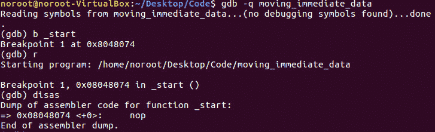
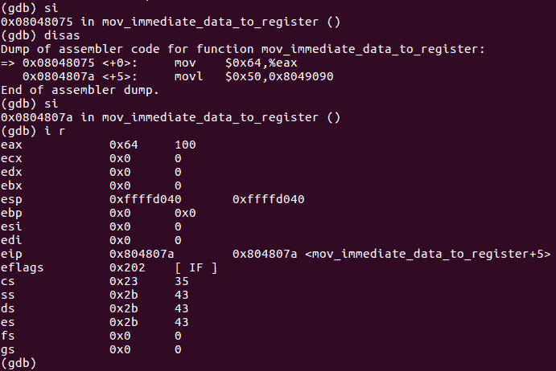
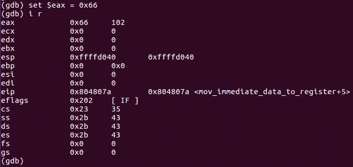

# 第 24 部分- ASM 黑客 1[移动即时数据]

> 原文:[https://0x infection . github . io/reversing/pages/part-24-ASM-hacking-1-moving-immediate-data . html](https://0xinfection.github.io/reversing/pages/part-24-asm-hacking-1-moving-immediate-data.html)

如需所有课程的完整目录，请点击下方，因为除了课程涵盖的主题之外，它还会为您提供每个课程的简介。[https://github . com/mytechnotalent/逆向工程-教程](https://github.com/mytechnotalent/Reverse-Engineering-Tutorial)

让我们从将二进制文件加载到 GDB 开始。

要加载到 GDB，请键入:

**GD b-q moving _ immediate _ data**

让我们首先通过键入 **b _start** 在 start 上设置一个断点。

然后我们可以通过输入 **r** 来运行程序。

为了开始反汇编，我们只需输入 **disas** 。

我们编写了一个 **nop** 表示没有操作，或者从操作码的角度编写了 **0x90** 用于断点正确命中的正确调试目的。这是创建汇编程序时的一个好习惯。

让我们找点乐子！此时，让 **si** 执行一次 **i r** 以查看 **0x64** 实际上已经被移动到 **EAX** 中。

我们可以看到 **EAX** 的值为十进制的 **0x64** 或 **100** 。现在让我们通过键入 **set $eax = 0x66** 来设置 **EAX** 为类似于 **0x66** 的值。

嘭！我们走吧！你可以在这里看到组装的终极力量！我们只是将数值从十进制的 **0x64** 修改为 **0x66** 或者 **100** 修改为 **102** 。这是一个微不足道的例子，但是你可以清楚地看到，当你学会掌握这些概念时，你就拥有了更强大的计算机能力。对于我们创建的每一个程序，我们都会有一个非常简单的课程，就像这样，我们将劫持至少一部分代码，这样我们不仅可以看到程序是如何创建和调试的，还可以看到我们是如何操纵它的。

我期待着下周在我们开始创建第二个汇编程序时与大家见面！