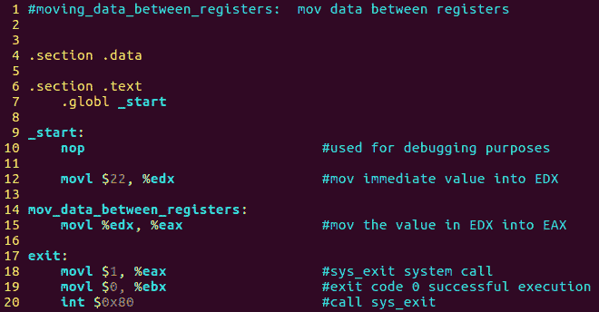

# 第 25 部分- ASM 程序 2[在寄存器之间移动数据]

> 原文：<https://0xinfection.github.io/reversing/pages/part-25-asm-program-2-moving-data-between-registers.html>

如需所有课程的完整目录，请点击下方，因为除了课程涵盖的主题之外，它还会为您提供每个课程的简介。[https://github . com/mytechnotalent/逆向工程-教程](https://github.com/mytechnotalent/Reverse-Engineering-Tutorial)

在我们的第二个程序中，我们将演示如何在寄存器之间移动数据。将数据从一个寄存器转移到另一个寄存器是最快的方式。建议尽可能多地在寄存器之间保存数据，以提高速度。

具体来说，我们将把 EDX 的价值转移到 EAX。我们将用一个简单的 22 进制的立即值初始化这个程序，它将进入 EDX，最终进入 EAX。

请记住，您只能在彼此之间移动相似的寄存器。我们知道 EAX 和 EDX 是 32 位寄存器。我们知道，这些寄存器中的每一个都可以通过其 16 位值(分别为 ax 和 dx)来访问。您不能将 32 位值转换为 16 位值，反之亦然。

我期待着下周我们开始调试第二个汇编程序时与大家见面！