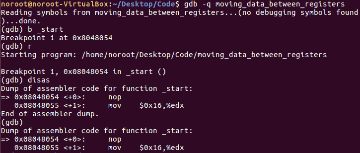
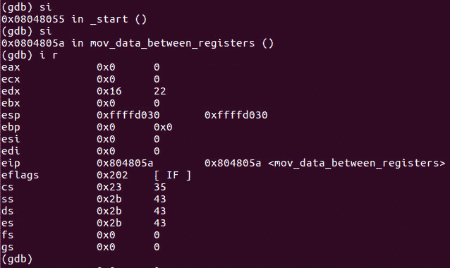
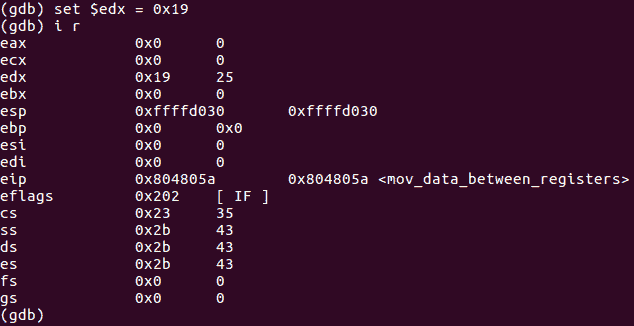

# 第 27 部分- ASM 黑客 2[在寄存器之间移动数据]

> 原文:[https://0x infection . github . io/reversing/pages/part-27-ASM-hacking-2-moving-data-between-registers . html](https://0xinfection.github.io/reversing/pages/part-27-asm-hacking-2-moving-data-between-registers.html)

如需所有课程的完整目录，请点击下方，因为除了课程涵盖的主题之外，它还会为您提供每个课程的简介。[https://github . com/mytechnotalent/逆向工程-教程](https://github.com/mytechnotalent/Reverse-Engineering-Tutorial)

下面我们来黑一下第二个程序:

让我们启动 GDB 并在 _start 上中断，运行二进制文件并关闭:

现在让 **si** 两次， **i r** :

我们可以看到十进制的值 **0x16** 或 **22** 确实成功地移入了 EDX。这就是我们在上节课中所做的，但是在这里，我们要将该值转换为其他值。

我们可以**设置$edx = 0x19** 例如:

正如你所看到的，我们很容易地将 EDX 的值修改为十进制的 T2 的 0x19 或 T4 的 25。

希望你能看到一些非常简单的模式，因为我们正在深入研究非常简单的汇编语言程序。关键是要理解如何操作值和指令，以便完全控制二进制文件。

在本教程的剩余部分，我们将继续以蜗牛般的速度前进，因为我的目标是给每个人一个非常小的例子来了解 x86 汇编。

我期待着下周我们开始编写第三个汇编程序时与大家见面！