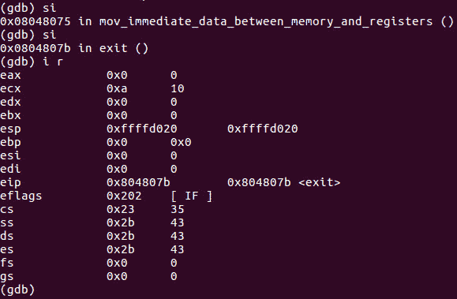

# 第 29 部分- ASM 调试 3[在内存和寄存器之间移动数据]

> 原文:[https://0x infection . github . io/reversing/pages/part-29-ASM-debugging-3-moving-data-between-memory-and-registers . html](https://0xinfection.github.io/reversing/pages/part-29-asm-debugging-3-moving-data-between-memory-and-registers.html)

如需所有课程的完整目录，请点击下方，因为除了课程涵盖的主题之外，它还会为您提供每个课程的简介。[https://github . com/mytechnotalent/逆向工程-教程](https://github.com/mytechnotalent/Reverse-Engineering-Tutorial)

我们来调试吧！

具体来说，我们将把 10 进制的常量整数中的值移入 ECX。

我们在安静模式下打开 GDB，按照上面的命令中断 on _start 并运行。

我们可以看到，当我们注册信息时，ECX 的值是 0。

在我们进入两次之后，我们现在看到 ECX 的值是 0xa 十六进制的十进制数 10。

我期待着下周我们开始编写第三个汇编程序时见到大家！