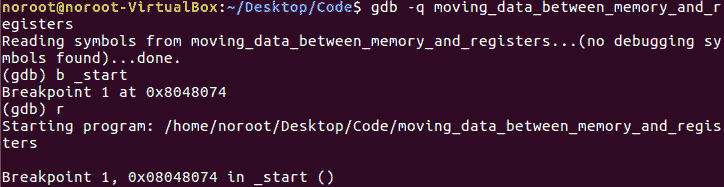
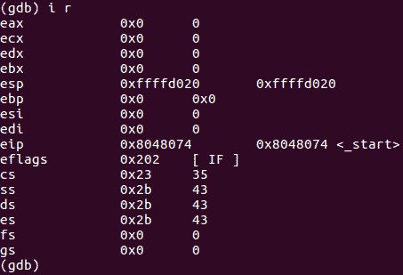
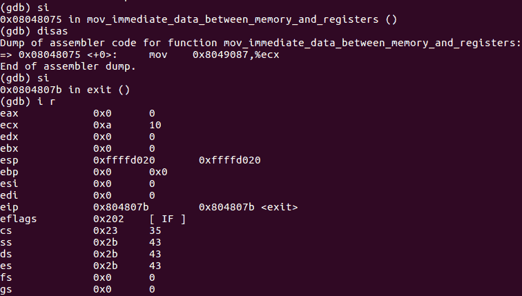
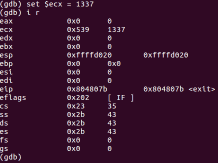

# 第 30 部分-ASM Hacking 3[在内存和寄存器之间移动数据]

> 原文:[https://0x infection . github . io/reversing/pages/part-30-ASM-hacking-3-moving-data-between-memory-and-registers . html](https://0xinfection.github.io/reversing/pages/part-30-asm-hacking-3-moving-data-between-memory-and-registers.html)

如需所有课程的完整目录，请点击下方，因为除了课程涵盖的主题之外，它还会为您提供每个课程的简介。[https://github . com/mytechnotalent/逆向工程-教程](https://github.com/mytechnotalent/Reverse-Engineering-Tutorial)

我们黑吧！

具体来说，我们会像以前一样，将 10 进制的常量整数中的值移动到 ECX 中。

我们在安静模式下打开 GDB，按照上面的命令中断 on _start 并运行。

我们可以看到，当我们注册信息时，ECX 的值是 0。让我们做一个 si 和另一个 si。

如你所见，ECX 的值是十进制的 10 或十六进制的 0xa，正如在上一课中一样。现在让我们将该值改为其他值。

让我们**设置$ecx = 1337** 并执行 i r。

你可以清楚地看到，我们已经将 ECX 的值破解为 0x539 十六进制或 1337 十进制。

正如我在这一系列文章中所说的。每一课都是非常小的例子，这样你就可以获得如何应对各种情况的硬肌肉记忆，从而最终完全掌握处理器控制。

我期待着下周在我们开始创建第四个汇编程序时与大家见面！