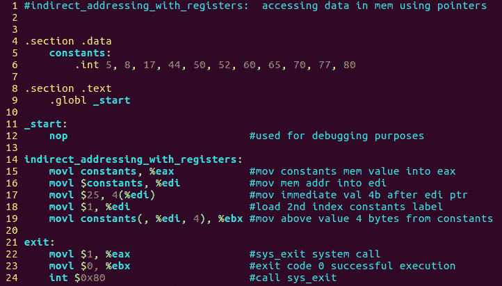

# 第 34 部分- ASM 程序 5[寄存器间接寻址]

> 原文：<https://0xinfection.github.io/reversing/pages/part-34-asm-program-5-indirect-addressing-with-registers.html>

如需所有课程的完整目录，请点击下方，因为除了课程涵盖的主题之外，它还会为您提供每个课程的简介。[https://github . com/mytechnotalent/逆向工程-教程](https://github.com/mytechnotalent/Reverse-Engineering-Tutorial)

在我们的第五个程序中，我们将演示如何用寄存器操纵间接寻址。

如上所述，我们可以在内存中存放多个值。在过去，我们的内存位置包含一个单一的值。在上面你可以看到常量的值包含 11 个独立的值。

这将在内存中创建一系列连续的数据值。每个数据值占用一个整数或 4 字节的内存单元。

我们必须使用一个索引系统来确定这些值，因为我们上面创建的是一个数组。

我们将利用索引存储器模式，其中存储器地址由基地址、添加到基地址的偏移地址和数据元素的大小(在我们的情况下是 4 字节的整数)以及确定选择哪个数据元素的索引来确定。

请记住，数组从索引 0 开始。因此，在上面的代码中，我们看到 1 进入 edi，这是最终进入 ebx 的第二个索引。

我们将在下一课调试中对此进行更深入的探讨，但是我希望您花一些时间来研究上面的代码，并很好地理解正在发生的事情。

请记住组装 we 类型:

**as–32-o indirect _ addressing _ with _ registers . o indirect _ addressing _ with _ registers . s**

要链接目标文件，我们键入:

**ld -m elf_i386 -o 间接寻址寄存器间接寻址寄存器 o**

我期待着下周在我们开始调试第五个汇编程序时见到大家！