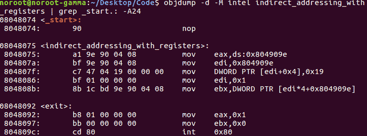
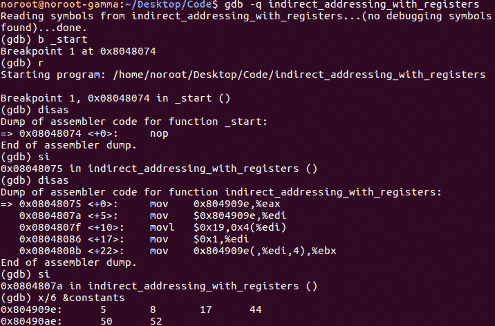
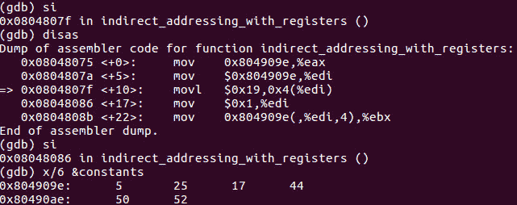

# 第 35 部分- ASM 调试 5[寄存器间接寻址]

> 原文:[https://0x infection . github . io/reversing/pages/part-35-ASM-debugging-5-indirect-addressing-with-registers . html](https://0xinfection.github.io/reversing/pages/part-35-asm-debugging-5-indirect-addressing-with-registers.html)

如需所有课程的完整目录，请点击下方，因为除了课程涵盖的主题之外，它还会为您提供每个课程的简介。[https://github . com/mytechnotalent/逆向工程-教程](https://github.com/mytechnotalent/Reverse-Engineering-Tutorial)

在我们的第五个程序中，我们演示了如何使用寄存器来处理间接寻址。

我想先解决我为什么使用美国电话电报公司语法的问题。在之前的课程中，我提供了许多在美国电话电报公司语法和英特尔语法之间轻松转换的方法。

我特意选择了这条路，这样可以迫使您适应最复杂的 x86 风格。如果您对这种语法感到困惑，请回顾前面的课程，因为我将介绍两者之间的区别。

让我们回顾一下。我们将使用 objdump 来获取一个编译后的二进制文件，比如我们在上节课中编译的二进制文件，并展示如何查看它的 Intel 源代码。

英特尔间接寻址寄存器| grep _start。:-A24

现在回到我们定期安排的节目。

让我们将二进制文件加载到 GDB 中，并中断 on _start，单步执行几个步骤，检查常量标签中 11 个值中的 6 个。

然后，我们将 constants 标签的内存地址移动到 edi 中，并将即时值 25 decimal 移动到数组的第二个索引中。这实质上是一个源代码黑客，因为我们将原来的值 8 改为 25。

如果您检查源代码，您会看到第 18 行，其中我们将值 1 加载到 edi 中。请记住，这是第二个值，因为数组是从 0 开始的。

您可以看到，如前所述，我们将十进制的 8 值更改为 25。

这是我们第一次介绍汇编语言中的数组。理解它们是如何工作的是至关重要的，因为有一天你可能会成为恶意软件分析师或逆向工程师，查看任何数量的高级程序编译数组的编译二进制文件。

在下一课中，我们将手动破解 GDB 中的一个值。请记住，我们必须用一个立即值覆盖实际内存地址中的内容。乐趣才刚刚开始！

我期待着下周我们开始黑我们的第五个汇编程序时见到大家！