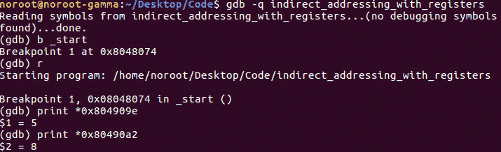
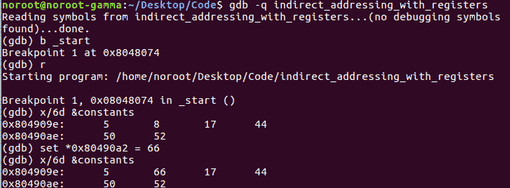

# 第 36 部分-ASM Hacking 5[用寄存器间接寻址]

> 原文：<https://0xinfection.github.io/reversing/pages/part-36-asm-hacking-5-indirect-addressing-with-registers.html>

如需所有课程的完整目录，请点击下方，因为除了课程涵盖的主题之外，它还会为您提供每个课程的简介。[https://github . com/mytechnotalent/逆向工程-教程](https://github.com/mytechnotalent/Reverse-Engineering-Tutorial)

让我们再检查一次来源。

让我们再次将二进制文件加载到 GDB，并在 _start 上中断。

当我们看上面时，我们看到命令 print *0x804909e。我们看到它产生了一个十进制 5 的值。运行时的二进制文件将常量标签中的值放入各自的内存地址。

在这种情况下，我们看到指向 0x804909e 或*0x804909e 的指针包含 5 个十进制数，如上所述。一个整数包含 4 个字节的数据。数组中的下一个值将存储在 0x80490a2 中。这个存储单元将保存值 8。

如果我们继续在数组中前进，我们将移动 4 个字节到下一个值，依此类推。请记住，x86 32 位汇编中的每个内存位置保存 4 个字节的数据。

我们黑吧！

在我们中断 on _start 并运行之后，我们像在上一课中那样检查了数组。在这里，我们将 0x80490a2 处的值从十进制的 8 位修改为 66 位，我们可以看到我们成功地更改了数组中的一个元素。

这一课对于理解数组最终是如何存储在内存中，以及如何操作和破解它们非常重要。如果你有任何问题，请在下面的评论中留下。

我期待着下周我们开始编写第六个汇编程序时与大家见面！