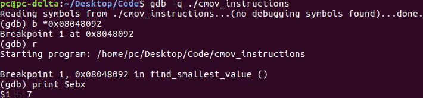
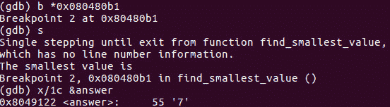

# 第 38 部分- ASM 调试 6 [CMOV 指令]

> 原文：<https://0xinfection.github.io/reversing/pages/part-38-asm-debugging-6-cmov-instructions.html>

如需所有课程的完整目录，请点击下方，因为除了课程涵盖的主题之外，它还会为您提供每个课程的简介。[https://github . com/mytechnotalent/逆向工程-教程](https://github.com/mytechnotalent/Reverse-Engineering-Tutorial)

让我们重新检查一些源代码。

让我们在 0x08048092 也就是第 31 行中断。让我们运行一个 r，然后键入 **print $ebx** 。我们可以看到 7 的价值。

好了，现在让我们从 0x080480b1，也就是第 46 行开始。请记住，当我们检查**答案**的值时，它已经被转换为 ascii 可打印的等价物，因此为了查看‘7’的值，您可以键入 **x/1c &答案**。

我期待着下周我们开始黑我们的第六个汇编程序时见到你们！