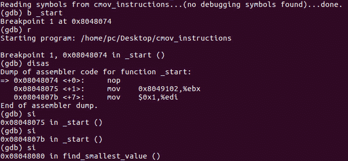
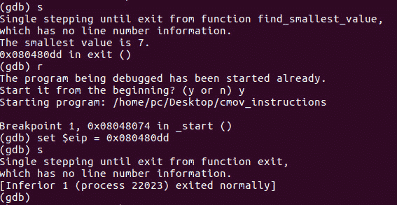

# 第 39 部分- ASM 黑客 6 [CMOV 指令]

> 原文:[https://0x infection . github . io/reversing/pages/part-39-ASM-hacking-6-cmov-instructions . html](https://0xinfection.github.io/reversing/pages/part-39-asm-hacking-6-cmov-instructions.html)

如需所有课程的完整目录，请点击下方，因为除了课程涵盖的主题之外，它还会为您提供每个课程的简介。[https://github . com/mytechnotalent/逆向工程-教程](https://github.com/mytechnotalent/Reverse-Engineering-Tutorial)

让我们将二进制代码带入 gdb。

现在让我们运行二进制文件。我们看到最小值是预期的 7。我们在本教程中的最后一点指示将教你如何跳转到你选择的执行的任何部分。

我们**设置$eip = 0x080480dd** ，这是退出例程。我们现在看到，当我们中断 on _start 时，它绕过了 nop 指令的所有代码。现在，您可以使用该命令跳转到调试器中任何二进制文件内的任何位置。

我期待着下周我们结束教程系列时与大家见面。