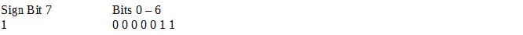
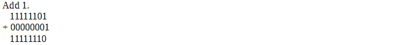
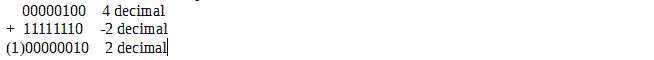

# 第 4 部分–二进制减法

> 原文：<https://0xinfection.github.io/reversing/pages/part-4-binary-subtraction.html>

如需所有课程的完整目录，请点击下方，因为除了课程涵盖的主题之外，它还会为您提供每个课程的简介。[https://github . com/mytechnotalent/逆向工程-教程](https://github.com/mytechnotalent/Reverse-Engineering-Tutorial)

二进制减法无非是把要减的数的负值相加。例如 8 + - 4，起点将是零，我们正向移动 8 个点，然后负向移动 4 个点，得到值 4。

我们用二进制表示一个符号位，第 7 位表示数的符号，其中 0 为正，1 为负。

以上将代表-2。

我们利用二进制补码的概念，将每个位反转，最后加 1。

让我们检查二进制 2。

**00000010**

反转这些位。

**11111101**

让我们检查一个减法运算:

你可能会问，溢出位是什么？在未来的教程中，我们将研究我们所说的溢出标志和进位标志。

下周我们将深入研究单词长度！敬请期待！