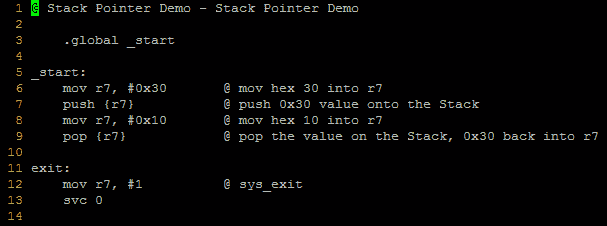
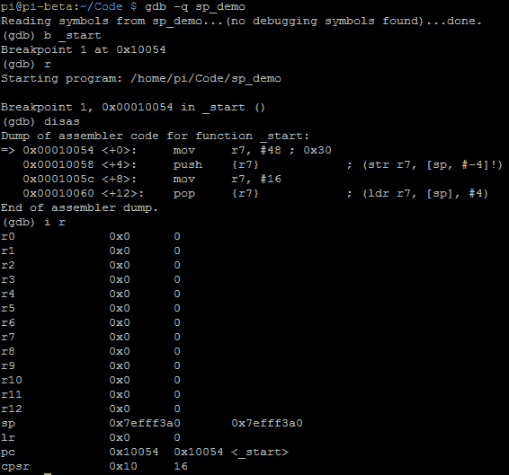
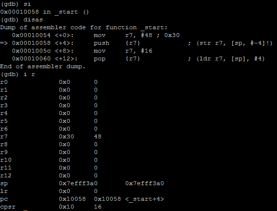
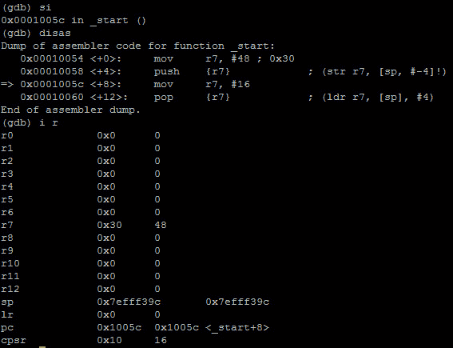
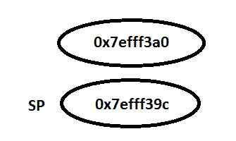
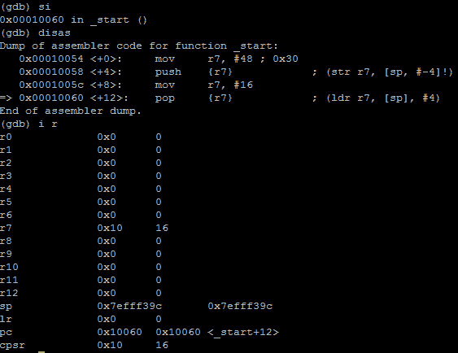
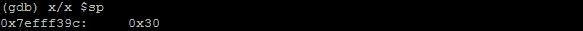
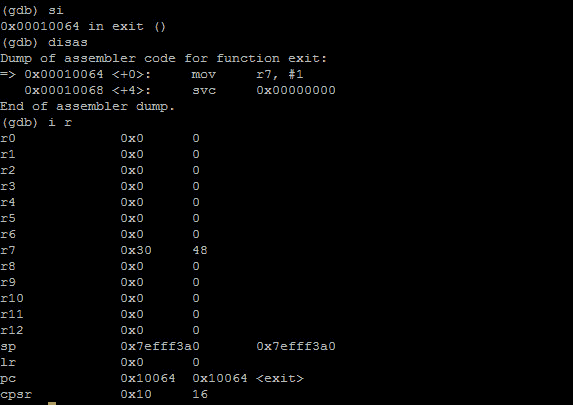
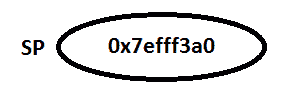

# 第 10 部分-堆栈指针

> 原文:[https://0x infection . github . io/reversing/pages/part-10-stack-pointer . html](https://0xinfection.github.io/reversing/pages/part-10-stack-pointer.html)

如需所有课程的完整目录，请点击下方，因为除了课程涵盖的主题之外，它还会为您提供每个课程的简介。[https://github . com/mytechnotalent/逆向工程-教程](https://github.com/mytechnotalent/Reverse-Engineering-Tutorial)

堆栈是一种抽象数据类型，属于 LIFO(后进先出)。当我们将一个值压入堆栈时，它进入堆栈指针，当它从堆栈中弹出时，它将该值从堆栈中弹出并放入你选择的寄存器中。

代码时间！同样，如果您不理解这里的代码示例中的所有内容，也不要气馁。在接下来的几课中，这一点会变得很清楚。



要编译:

```
as -o sp_demo.o sp_demo.s

ld -o sp_demo sp_demo.o

```

让我们再次将二进制文件加载到 GDB，看看会发生什么。



让我们步入一个时代。



我们看到**十六进制 30** 或**十进制 48**被移入 **r7** 。让我们再次步入。



我们看到 **sp** 的值从 **0x7efff3a0** 变为 **0xefff39c** 。那就是向后移动 **4 个字节**。你可能会问，栈指针为什么向后移动？

答案围绕着这样一个事实:堆栈向下增长**。当我们说堆叠的顶部时，你可以想象一系列的盘子被放置在彼此的下面**。****

 **原来 **sp** 在**0x 7 eff 3a 0**。


当我们将 **r7** 压入堆栈时，**堆栈指针**的新值现在是 **0x7efff39c** ，因此我们可以看到堆栈在内存中真正向下**增长**。



现在让我们再次步入。



我们可以看到**十六进制 10** 或**十进制 16** 的值被移入 **r7** 。注意 **sp** 没有变化。

在我们再次进入之前，让我们看一下 **sp** 中的值。



让我们再次步入。



我们看到堆栈中的值被弹出堆栈并放回 **r7** 中，因此**十六进制 30** 的值回到 **r7** 中，并且 **sp** 回到 **0x73fff3a0** 。



请花时间键入代码，编译并链接它，然后在 GDB 单步调试二进制文件。堆栈操作对于理解逆向工程和恶意软件分析以及任何类型的调试都至关重要。

下周我们将深入探讨 ARM 固件引导程序。**