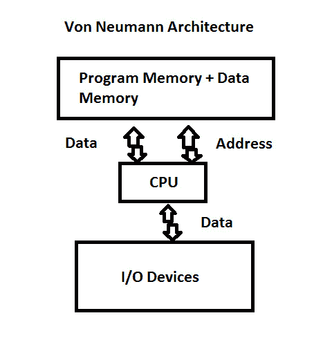

# 第 12 部分-冯·诺依曼架构

> 原文：<https://0xinfection.github.io/reversing/pages/part-12-von-neumann-architecture.html>

如需所有课程的完整目录，请点击下方，因为除了课程涵盖的主题之外，它还会为您提供每个课程的简介。[https://github . com/mytechnotalent/逆向工程-教程](https://github.com/mytechnotalent/Reverse-Engineering-Tutorial)

ARM 是一个加载和存储机器，算术逻辑单元只对寄存器本身和任何需要存储到 RAM 的数据进行操作，控制单元在共享同一数据总线的存储器和寄存器之间移动数据。

这种架构的 CPU 芯片拥有一个控制单元和算术逻辑单元(以及一些本地存储器),主存储器以 RAM 棒的形式位于主板上。

存储程序数字计算机是一种将程序指令和数据保存在读写随机存储器或 ram 中的计算机。

下周我们将深入研究指令流水线。