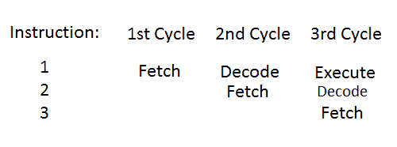

# 第 13 部分-指令管道

> 原文：<https://0xinfection.github.io/reversing/pages/part-13-instruction-pipeline.html>

如需所有课程的完整目录，请点击下方，因为除了课程涵盖的主题之外，它还会为您提供每个课程的简介。[https://github . com/mytechnotalent/逆向工程-教程](https://github.com/mytechnotalent/Reverse-Engineering-Tutorial)

处理器有三个独立的工作阶段，分别是:

1) **获取阶段**–控制单元从存储器中获取指令，并将其加载到指令寄存器中。

2) **解码阶段**–控制单元配置处理器内的所有硬件来执行指令。

3) **执行阶段**–处理器计算指令或操作的结果。

当处理器处理指令 1 时，我们称之为处于提取阶段。当处理器处理指令 2 时，指令 1 进入解码阶段，指令 2 进入提取阶段。当处理器处理指令 3 时，指令 2 进入解码阶段，指令 1 进入执行阶段。

请记住，如果出现分支指令，管道可能会被刷新，并以一组新的周期重新开始。

现在，您已经掌握了 ARM 汇编的坚实基础和背景知识，了解了它在内存和相应寄存器之间的加载和存储能力，以及指令集如何流动的基本知识。

下周我们将深入我们的第一个 C++程序！