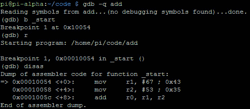
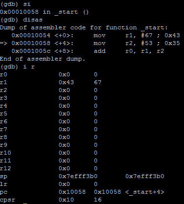
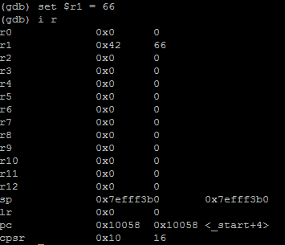
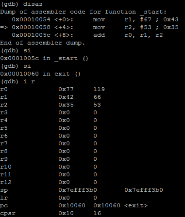

# 第 16 部分-黑客添加

> 原文:[https://0x infection . github . io/reversing/pages/part-16-hacking-add . html](https://0xinfection.github.io/reversing/pages/part-16-hacking-add.html)

如需所有课程的完整目录，请点击下方，因为除了课程涵盖的主题之外，它还会为您提供每个课程的简介。[https://github . com/mytechnotalent/逆向工程-教程](https://github.com/mytechnotalent/Reverse-Engineering-Tutorial)

让我们再次回顾一下下面的添加示例:

我们来调试一下:

我们看到十进制数 67 的值被移入下面的 T2 R1:

我们黑吧！让我们设置 **r1 = 66** ！

现在我们看到我们已经破解了程序，所以当它添加值时，它会有不同的输出。如果你还记得上节课的话， **r0 = 120** 。这里我们看到我们已经攻击了 r1，现在 **r0** 的值是 **119** ！

这就是理解组装的力量。这是一个非常简单的例子，但是对于每一个新的系列，正如我所说的，我们将创建一个程序，调试并破解它。

这种指令组合将帮助您在学习如何对应用程序进行绝对控制时获得实践经验，并且在恶意软件逆向工程的情况下，让您能够让二进制文件完全按照您想要的那样运行！

下周我们将深入研究 ADDS。