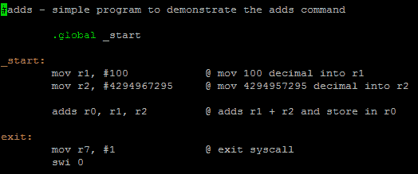
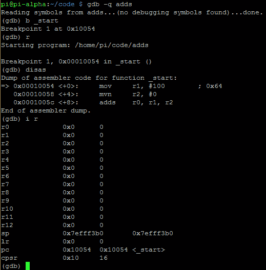
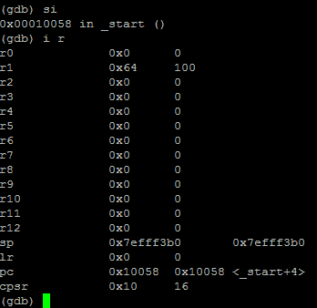
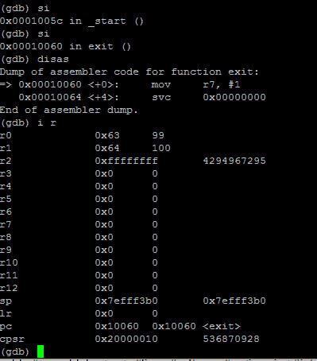

# 第 18 部分-调试增加

> 原文：<https://0xinfection.github.io/reversing/pages/part-18-debugging-adds.html>

如需所有课程的完整目录，请点击下方，因为除了课程涵盖的主题之外，它还会为您提供每个课程的简介。[https://github . com/mytechnotalent/逆向工程-教程](https://github.com/mytechnotalent/Reverse-Engineering-Tutorial)

让我们重新检查我们的代码:

我们再将****加 100** 进 **r1** ，**4294967295**进 **r2** 。然后我们**添加 r1** 和 **r2** 并放入 **r0。****

让我们调试:

我们再次看到**添加了**来设置 CPSR 中的标志。我们必须记住，当我们在 GDB 调试时，CPSR 的值是十六进制的。为了查看设置了什么标志，我们必须将十六进制转换为二进制。当我们在接下来的教程中开始调试和破解这个例子时，这是有意义的。

我们需要记住，CPSR 中的第 31、20、29 和 28 位表示以下内容:

**位 31 - N =负标志**

**位 30 - Z =零标志**

**位 29 - C =进位标志**

**位 28 - V =溢出标志**

我们看到 **CPSR** 在 **10 十六进制**。**十进制的**在二进制中是 **00010000** 。

因此，如果二进制中的值是第 31、30、29 和 28 位的**00010000**(**NZCV**，这将意味着:

**否定标志未设置**

**零标志未设置**

**进位标志未设置**

**溢出标志设置**

上面的代码中没有设置**溢出标志**的内容，但是在它的自然状态下，在执行这个二进制文件时，它被设置。

让我们一步一步地完成这个程序:

我们看到 **64 个十六进制**或 **100 个十进制**如预期一样被移入 **r1** 。 **CPSR** 没有变化。让我们再走一步。

我们看到上面发生的加法，并注意到在十进制的**100**和十进制的**4294967295**相加之后， **r0** 中的值是十进制的**99**。这怎么可能呢？答案很简单，我们从这个加法溢出了 **r0** 的 32 位寄存器。

如果我们检查 **CPSR** 我们现在看到 **20000010 十六进制**或**0010 0000 0000 0000 0000 0000 0001 0000 二进制**。我们只需关注最高有效位，它们是:

二进制的值是第 31、30、29 和 28 位的**0010**(**NZCV**)，这意味着:

**否定标志未设置**

**零标志未设置**

**进位标志设置**

**溢出标志未设置**

我们看到**进位标志**已经设置，而**溢出标志**没有设置。为什么会这样？

**进位标志**是当两个**无符号数**相加并且结果大于保存它的寄存器时设置的标志。我们正在处理一个 32 位寄存器。我们也处理无符号数，因此 **CF** 被设置，而的**不像**标志的**处理**有符号数**。**

下周我们将深入探讨黑客添加。