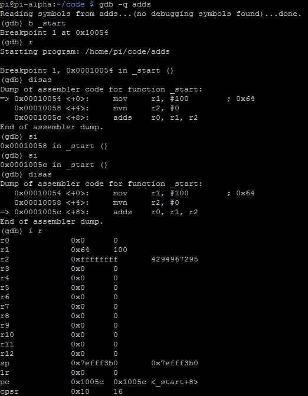
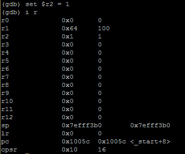
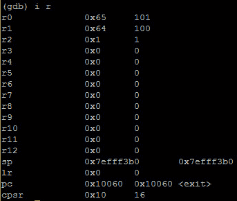

# 第 19 部分-黑客补充

> 原文:[https://0x infection . github . io/reversing/pages/part-19-hacking-adds . html](https://0xinfection.github.io/reversing/pages/part-19-hacking-adds.html)

如需所有课程的完整目录，请点击下方，因为除了课程涵盖的主题之外，它还会为您提供每个课程的简介。[https://github . com/mytechnotalent/逆向工程-教程](https://github.com/mytechnotalent/Reverse-Engineering-Tutorial)

让我们再次重新检查我们的代码:

我们再将****加 100** 进 **r1** ，**4294967295**进 **r2** 。然后我们**添加 r1** 和 **r2** 并放入 **r0。****

让我们调试:

我们再次看到**添加了**来设置 CPSR 中的标志。我们必须记住，当我们在 GDB 调试时，CPSR 的值是十六进制的。为了查看设置了什么标志，我们必须将十六进制转换为二进制。当我们在接下来的教程中开始调试和破解这个例子时，这是有意义的。

我们需要记住，CPSR 中的第 31、20、29 和 28 位表示以下内容:

**位 31 - N =负标志**

**位 30 - Z =零标志**

**位 29 - C =进位标志**

**位 28 - V =溢出标志**

我们看到 **CPSR** 在 **10 十六进制**。**十进制**二进制是 **0001** 。

因此，如果二进制中的值是第 31、30、29 和 28 位的**0001**(**NZCV**，这将意味着:

**否定标志未设置**

**零标志未设置**

**进位标志未设置**

**溢出标志设置**

让我们再来看看:

我们在 **r2** 中看到 **4294967295 十进制**或者 **0xffffffff** 。我们知道，如果我们再次步进，我们将导致 CPSR 从 0001 变为 0010，这意味着:

二进制的值是第 31、30、29 和 28 位的**0010**(**NZCV**)，这意味着:

**否定标志未设置**

**零标志未设置**

**进位标志设置**

**溢出标志未设置**

此操作设置进位标志。然而，让我们黑客:

我们黑掉了 **r2** ，把值改成了 **1 十进制**和 **0x1 十六进制**。现在我们知道在上次 **CPSR** 去 **0010** 之前，但是现在我们黑了这个，让我们看看当我们步进时 **CPSR** 会发生什么。

嘭！我们破解了它，看到 **r0** 是 **101** ，因此没有触发进位标志，并将 **CPSR** 保持在 **0x10 十六进制**，这意味着 **0001 二进制**，这意味着:

因此，如果二进制中的值是第 31、30、29 和 28 位的**0001**(**NZCV**，这将意味着:

**否定标志未设置**

**零标志未设置**

**进位标志未设置**

**溢出标志设置**

你全面理解这一课是非常重要的。如果没有，请复习过去两周的课程。

下周我们将深入探讨 ADC。