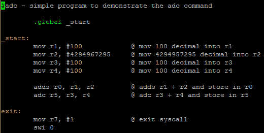

# 第 20 部分–ADC

> 原文:[https://0x infection . github . io/reversing/pages/part-20-ADC . html](https://0xinfection.github.io/reversing/pages/part-20-adc.html)

如需所有课程的完整目录，请点击下方，因为除了课程涵盖的主题之外，它还会为您提供每个课程的简介。[https://github . com/mytechnotalent/逆向工程-教程](https://github.com/mytechnotalent/Reverse-Engineering-Tutorial)

ADC 与 ADD 相同，但如果进位标志置位，它会加 1。使用 ADC 时，我们需要特别注意 CPSR 或状态寄存器。

让我们看一个例子来说明:



我们**将** **100** 十进制加到 **r1** ，将**4294967295**加到 **r2** ，将 **100** 十进制加到 **r3** ，将 **100** 十进制加到 **r4** 。然后**添加 r1** 和 **r2** 并放入 **r0** 中，然后**添加 r3** 和 **r4** 并放入 **r5** 中。

我们看到**添加了**，它设置了 CPSR 中的标志。我们必须再次记住，当我们在 GDB 调试时，CPSR 的值是十六进制的。为了查看设置了什么标志，我们必须将十六进制转换为二进制。当我们在接下来的教程中开始调试和破解这个例子时，这是有意义的。

您可以通过以下方式编译上面的代码:

```
as -o adc.o adc.s
ld -o adc adc.o

```

我想让你问问自己，当 **r3(十进制 100)**加到 **r4(十进制 100)**上会发生什么？你认为上面用加法结果设置标志的例子中 **r5** 的值会是多少？思考本教程中的第一句话，并在下一个教程中牢记这一点。

下周我们将深入探讨 ADC 调试。