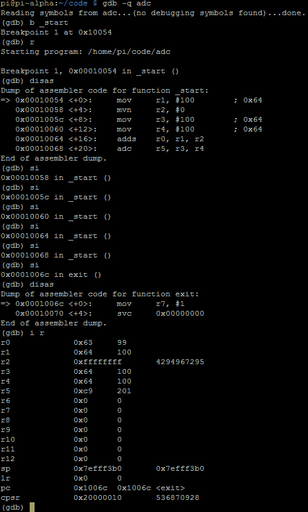

# 第 21 部分–调试 ADC

> 原文:[https://0x infection . github . io/reversing/pages/part-21-debugging-ADC . html](https://0xinfection.github.io/reversing/pages/part-21-debugging-adc.html)

如需所有课程的完整目录，请点击下方，因为除了课程涵盖的主题之外，它还会为您提供每个课程的简介。[https://github . com/mytechnotalent/逆向工程-教程](https://github.com/mytechnotalent/Reverse-Engineering-Tutorial)

概括地说，ADC 与 ADD 相同，只是在进位标志置位时会加 1。使用 ADC 时，我们需要特别注意 CPSR 或状态寄存器。

让我们回顾一下我们的代码:

我们**将** **100** 十进制加到 **r1** ，将**4294967295**加到 **r2** ，将 **100** 十进制加到 **r3** ，将 **100** 十进制加到 **r4** 。然后**添加 r1** 和 **r2** 并放入 **r0** 中，然后**添加 r3** 和 **r4** 并放入 **r5** 中。

我们看到**添加了**，它设置了 CPSR 中的标志。我们必须再次记住，当我们在 GDB 调试时，CPSR 的值是十六进制的。为了查看设置了什么标志，我们必须将十六进制转换为二进制。当我们在接下来的教程中开始调试和破解这个例子时，这是有意义的。

上周我提出了一个问题，我想让你问问自己，当 **r3(十进制 100)**加到 **r4(十进制 100)**上会发生什么？你认为上面用加法结果设置标志的例子中 **r5** 的值会是多少？

好的，那么我们将 **r3** 和 **r4** 中的 **100 十进制**和 **100 十进制**相加，我们得到 **201** **十进制**中的 **r5** ！有什么东西坏了吗？ADC 与 ADD 相同，但如果进位标志置位，它会加 1。因此我们在 **r5** 中得到额外的 1。

我们需要再次记住，CPSR 中的第 31、20、29 和 28 位表示以下内容:

**位 31 - N =负标志**

**位 30 - Z =零标志**

**位 29 - C =进位标志**

**位 28 - V =溢出标志**

我们在 **20000010 十六进制**看到 **CPSR** 。二进制中 **20000010 十六进制**的最高有效位是 **0010** 。

因此，如果二进制中的值是第 31、30、29 和 28 位的**0010**(**NZCV**，这将意味着:

**否定标志未设置**

**零标志未设置**

**进位标志设置**

**溢出标志未设置**

我们可以清楚地看到，进位标志已设置。我希望你能消化和理解这些非常简单的操作，以及它们如何对 CPSR 产生影响。

下周我们将深入探讨如何破解 ADC。