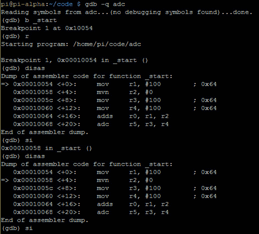
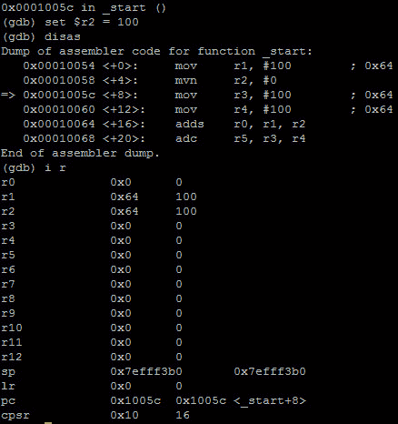
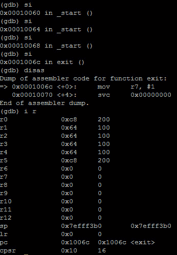

# 第 22 部分——入侵 ADC

> 原文:[https://0x infection . github . io/reversing/pages/part-22-hacking-ADC . html](https://0xinfection.github.io/reversing/pages/part-22-hacking-adc.html)

如需所有课程的完整目录，请点击下方，因为除了课程涵盖的主题之外，它还会为您提供每个课程的简介。[https://github . com/mytechnotalent/逆向工程-教程](https://github.com/mytechnotalent/Reverse-Engineering-Tutorial)

再次概括一下，ADC 与 ADD 相同，只是在进位标志置位时会加 1。使用 ADC 时，我们需要特别注意 CPSR 或状态寄存器。

让我们再次回顾我们的代码:

我们**将** **100** 十进制加到 **r1** ，将**4294967295**加到 **r2** ，将 **100** 十进制加到 **r3** ，将 **100** 十进制加到 **r4** 。然后**添加 r1** 和 **r2** 并放入 **r0** 中，然后**添加 r3** 和 **r4** 并放入 **r5** 中。

我们运行该程序，并转到将 **4，294，967，295** 移入 **r2** 的位置。让我们破解 **r2** 中的值，并将其更改为**十进制 100**。

让我们多走几步:

好了，现在我们将 **r3** 和 **r4** 中的 **100 十进制**和 **100 十进制**相加，我们得到 **200** **十进制**中的 **r5** ！你还记得上周我们有 201 次聚会吗？让我们看看下面的 CPSR。

我们需要再次记住，CPSR 中的第 31、20、29 和 28 位表示以下内容:

**位 31 - N =负标志**

**位 30 - Z =零标志**

**位 29 - C =进位标志**

**位 28 - V =溢出标志**

我们看到 **CPSR** 在 **10 十六进制**。二进制中 **10 进制**的最高有效位是 **0001** 。

因此，如果二进制中的值是第 31、30、29 和 28 位的**0001**(**NZCV**，这将意味着:

**否定标志未设置**

**零标志未设置**

**进位标志未设置**

**溢出标志设置**

我们可以清楚地看到，进位标志没有设置。我希望你能消化和理解这些非常简单的操作，以及它们如何对 CPSR 产生影响。请花点时间复习上周的课程，以便进行比较。

下周我们将潜入潜艇。