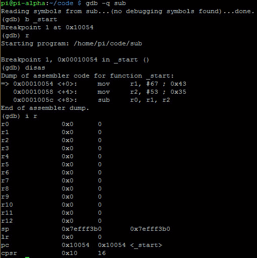
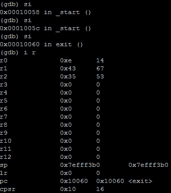

# 第 24 部分–调试接头

> 原文:[https://0x infection . github . io/reversing/pages/part-24-debugging-sub . html](https://0xinfection.github.io/reversing/pages/part-24-debugging-sub.html)

如需所有课程的完整目录，请点击下方，因为除了课程涵盖的主题之外，它还会为您提供每个课程的简介。[https://github . com/mytechnotalent/逆向工程-教程](https://github.com/mytechnotalent/Reverse-Engineering-Tutorial)

如上所述，ARM 中的减法有四个指令，分别是 SUB、SBC、RSB 和 RSC。我们今天从 SUB 开始。

请记住，当你在每个潜艇、SBCS、RSBS、RSCS 后面加上 S 后缀时，它会影响旗帜。在之前的课程中，我们已经花了足够多的时间在旗帜上，所以现在你应该已经牢牢掌握了。

让我们重新检查一下我们的 SUB 示例:

我们简单地取 **67 十进制**，移入 **r1** 和 **53 十进制**，移入 **r2** ，减去 R1-R2，并将结果放入 **r0** 。

我们来调试一下。

如我们所见，寄存器是清晰的。让我们一步步来，看看 **r0** 的值变成了什么。

正如你在上面看到的 **r0** 现在有了**十进制** **14** 它像预期的那样工作。

下周我们将深入探讨黑客技术。