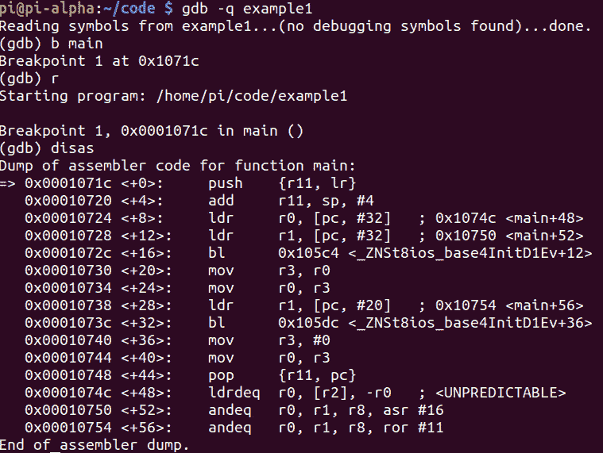
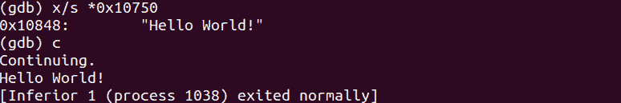
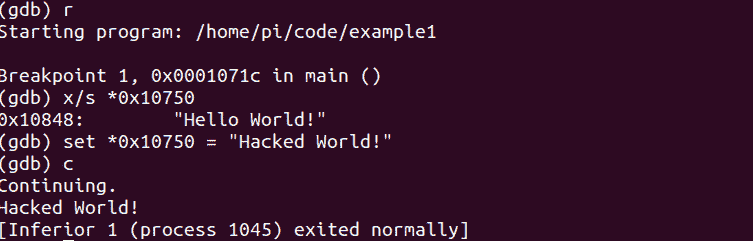
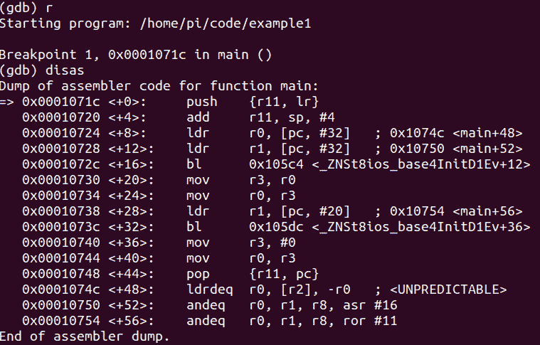
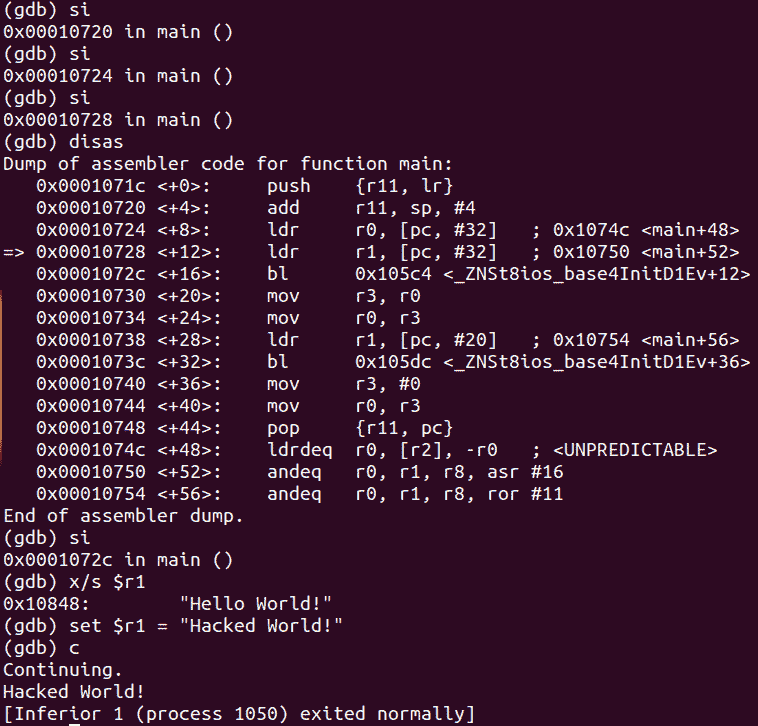

# 第 16 部分-入侵 Hello World

> 原文：<https://0xinfection.github.io/reversing/pages/part-16-hacking-hello-world.html>

如需所有课程的完整目录，请点击下方，因为除了课程涵盖的主题之外，它还会为您提供每个课程的简介。[https://github . com/mytechnotalent/逆向工程-教程](https://github.com/mytechnotalent/Reverse-Engineering-Tutorial)

让我们回顾一下两周前的代码。

让我们再调试一次。

让我们再次检查位于内存地址 **0x10750** 的字符串的内容，并继续执行程序。

如你所见，它包含了" **Hello World！**"字符串，当我们继续通过它时，回显到终端本身。

我们黑吧！现在让我们用字符串“ **Hacked World”覆盖内存地址中的值！**"并继续执行。

呜哇！我们的第一次入侵！正如你所看到的，当你理解汇编时，你对整个二进制文件有绝对的控制权，不管它是用什么语言写的。在这个非常简单的例子中，我们能够破解内存地址 **0x10750** 中的值，当执行该值时，它会回显，“**破解了世界！**"到端子或标准输出。

让我们再次运行二进制文件并进行反汇编。

现在让我们做同样的程序，但是让 **si** 3x 检查 **r1** 内部的字符串。我们看到它包含，“**你好世界！**"因为在 **main+12** 处已经成功 **ldr** (从存储器加载到寄存器中)。

现在让我们将 r1 设置为" **Hacked World！**"并继续执行。正如你所看到的，我们现在从寄存器中而不是在内存中破解它。你可以清楚地开始看到有许多方法可以破解任何东西，这里有两个简单的例子。

逆向工程就是要理解一个程序是如何执行的，并劫持执行流程和改变值来适应我们的目的！今天，你迈出了这个奇妙旅程的第一步！

下周我们将深入常数。