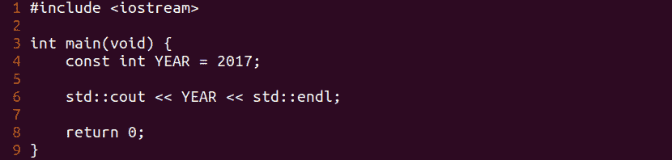
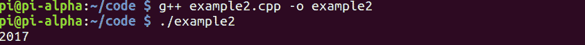

# 第 17 部分-常数

> 原文:[https://0x infection . github . io/reversing/pages/part-17-constants . html](https://0xinfection.github.io/reversing/pages/part-17-constants.html)

如需所有课程的完整目录，请点击下方，因为除了课程涵盖的主题之外，它还会为您提供每个课程的简介。[https://github . com/mytechnotalent/逆向工程-教程](https://github.com/mytechnotalent/Reverse-Engineering-Tutorial)

到目前为止，我们已经创建、调试并破解了一个到标准终端的简单字符串 echo。我们将通过增加一个常数来扩展这个例子。

C++中的常量是一个在程序执行过程中不会改变的值(除非被黑客攻击)。使用它可以让您在代码的早期就有一个声明，这样，如果您未来的程序架构发生变化，您可以在一个地方重新定义该常量，而不必在整个代码库中更新代码。

标准的做法是将我们的常量全部大写，这样当我们在代码的某个地方看到它被引用时，我们就知道这个值是一个常量。

我们从 C++中的第二个程序开始，它是我们的“常量”程序。让我们深入下去，一步一步地分解每一行，看看这种语言是如何工作的。我们将此称为 **example2.cpp** ，并将其保存到我们的设备中。

```
#include <iostream>

int main(void) {
            cons tint YEAR = 2017;

            std::cout << YEAR << std::endl;

            return 0;
}

```



要编译它，我们只需键入:

```
g++ example2.cpp -o example2

```

我们只需输入:

```
./example2

```



成功！我们看到“ **2017** 打印到标准输出或端子！

让我们来分解一下:

我们利用 **const** 关键字来表示一个常量，我们给它赋值 2017 的整数值。

然后，我们利用 **cout** 函数将其打印到标准输出或终端，并使用 **endl** 函数添加一个新行。

就是这样！很简单。

下周我们将深入调试常量。