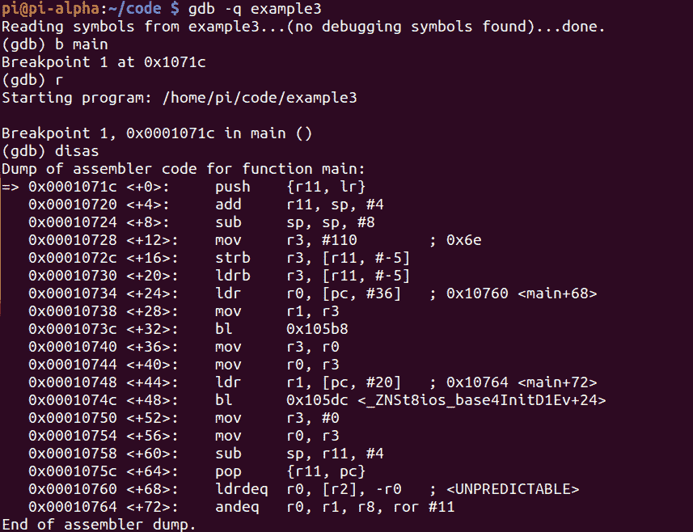
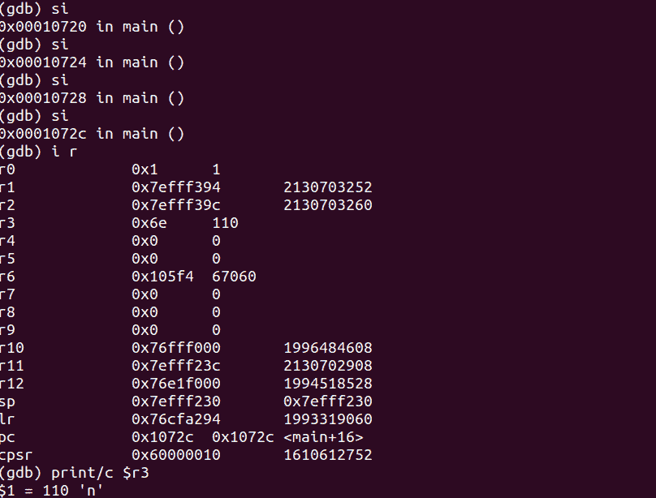
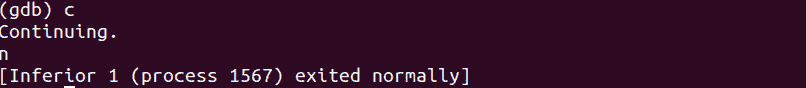

# 第 21 部分–调试字符变量

> 原文:[https://0x infection . github . io/reversing/pages/part-21-debugging-character-variables . html](https://0xinfection.github.io/reversing/pages/part-21-debugging-character-variables.html)

如需所有课程的完整目录，请点击下方，因为除了课程涵盖的主题之外，它还会为您提供每个课程的简介。[https://github . com/mytechnotalent/逆向工程-教程](https://github.com/mytechnotalent/Reverse-Engineering-Tutorial)

让我们回顾一下我们的代码。

我们来调试吧！

哇哦。这是令人困惑的。我没有看到任何明确的内存地址被加载到寄存器中来操纵数据。

让我们记住，我们正在处理一个单字节字符变量。

如果你还记得上周的内容，每个字符都被翻译成处理器能够理解的十六进制 ASCII 码。 **n** 的值是十六进制的 **0x6e** 或十进制的 **110** 。您可以查看任何 ASCII 表，看看我们是从哪里得到这个值的。

我们确实在 **main+12** 处看到了 **0x6e** ，也就是字符“ **n** ”。

如果我们单步执行几次，我们会注意到该值已被放入 **r3** 中。当我们打印出 **r3** 中的值时，我们现在看到了我们的“ **n** 字符。

我们继续。

我们现在看到' **n** '如预期的那样打印到标准输出中。

理解这一过程并理解每个字符转换成一个 ASCII 值是很重要的，处理器将该值直接载入相应的寄存器。在我们之前的经验中，我们看到了一个字符串被直接加载到一个内存位置，但这里不是这样。

下周我们将深入探讨如何破解字符变量。