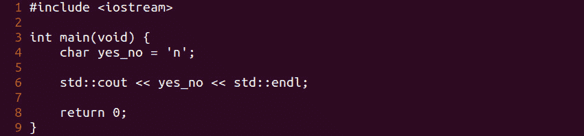
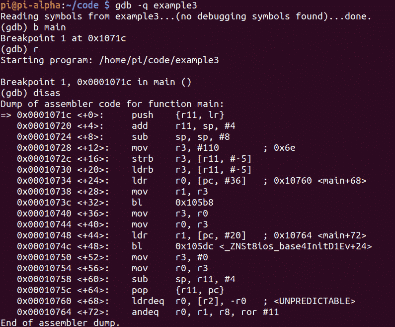
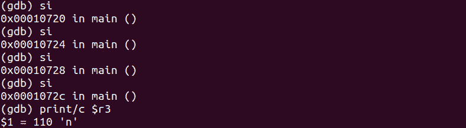
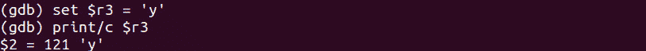
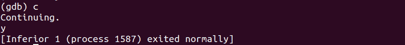

# 第 22 部分——破解字符变量

> 原文:[https://0x infection . github . io/reversing/pages/part-22-hacking-character-variables . html](https://0xinfection.github.io/reversing/pages/part-22-hacking-character-variables.html)

如需所有课程的完整目录，请点击下方，因为除了课程涵盖的主题之外，它还会为您提供每个课程的简介。[https://github . com/mytechnotalent/逆向工程-教程](https://github.com/mytechnotalent/Reverse-Engineering-Tutorial)

让我们回顾一下我们的代码。

我们黑吧！

我们再次看到 **0x6e** 的直接值在 **main+12** 处移入 **r3** ，这就是我们的“ **n** ”。

步进 4 次后，验证 **r3** 中的值，我们清楚地看到该值为“ **n** ”。

让我们将 **r3** 中的值破解为 a’**y**，然后重新检查 **r3** 中的值。我们现在可以清楚地看到它已经被改为' **y** '。

随着我们的继续，我们成功地看到我们的黑客工作！我们看到打印到标准输出的' **y** 的值。

下周我们将深入布尔变量。