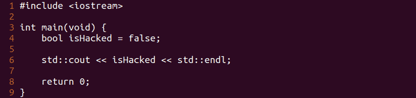
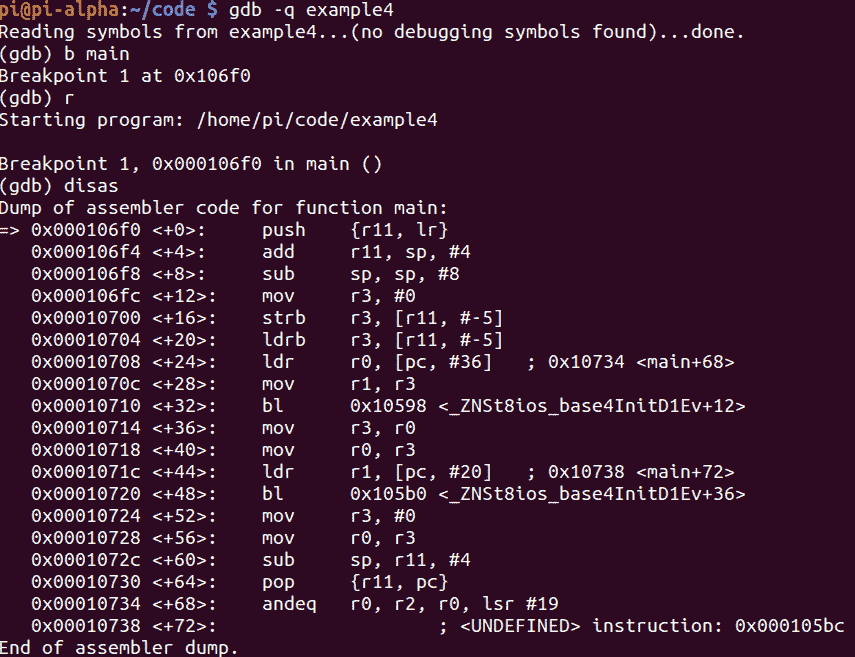
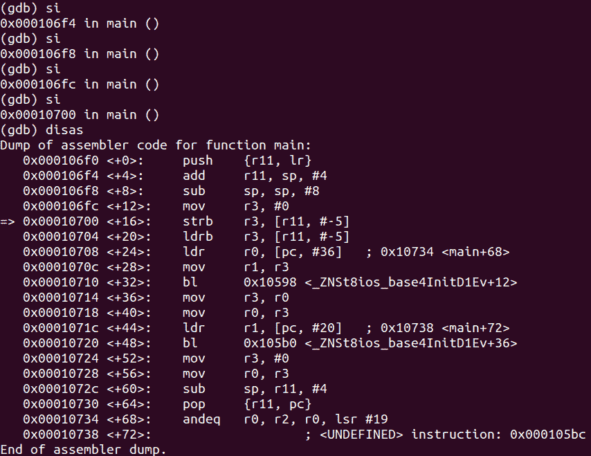

# 第 24 部分–调试布尔变量

> 原文:[https://0x infection . github . io/reversing/pages/part-24-debugging-boolean-variables . html](https://0xinfection.github.io/reversing/pages/part-24-debugging-boolean-variables.html)

如需所有课程的完整目录，请点击下方，因为除了课程涵盖的主题之外，它还会为您提供每个课程的简介。[https://github . com/mytechnotalent/逆向工程-教程](https://github.com/mytechnotalent/Reverse-Engineering-Tutorial)

让我们重新检查我们的代码。

我们来调试一下。

我们来 4 步，拆解。

让我们检查一下 **r3** 中现在有什么。

我们可以清楚地看到， **isHacked** 中的值是 **0** 或 **false** ，这在我们的 c++源代码中是有意义的。

我知道这些教训可能看起来微不足道，但是逆向工程就是将事物分解成最基本的组成部分。逆向工程是关于耐心和逻辑流程的。重要的是，你要花时间用 Raspberry Pi 设备完成所有这些例子，这样你才能正确理解这个过程实际上是如何工作的。

下周我们将深入探讨如何破解布尔变量。