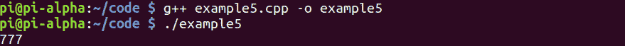

# 第 26 部分–整数变量

> 原文：<https://0xinfection.github.io/reversing/pages/part-26-integer-variables.html>

如需所有课程的完整目录，请点击下方，因为除了课程涵盖的主题之外，它还会为您提供每个课程的简介。[https://github . com/mytechnotalent/逆向工程-教程](https://github.com/mytechnotalent/Reverse-Engineering-Tutorial)

我们旅程的下一个阶段是整型变量。

32 位寄存器可以存储 2^32 不同的值。可以存储在 32 位中的整数值范围取决于所用的整数表示。对于两种最常见的表示法，范围是 0 到 4，294，967，295(2^32 1)表示(无符号)二进制数，2，147，483，648 (−2^31)到 2，147，483，647(2^31 1)表示二进制补码。

请记住，使用 32 位内存地址，您可以直接访问最大 4 GB 的字节可寻址内存。

让我们检查一下我们的代码。

```
#include <iostream>

int main(void) {

            int myNumber = 777;

            std::cout << myNumber << std::endl;

            return 0;

}

```


要编译它，我们只需键入:

g++示例 5.cpp -o 示例 5

。/示例 5



成功！我们看到 **777** 打印到标准输出或终端！

让我们来分解一下:

我们将整数 **777** 直接赋给变量 **myNumber** ，然后用 c++ **cout** 函数将其打印到终端。

下周我们将深入调试整数变量。