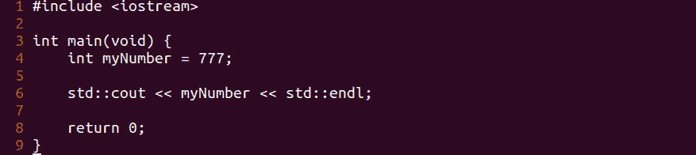
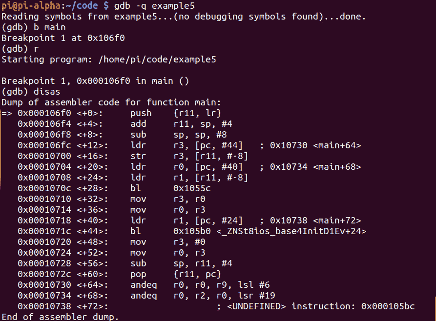
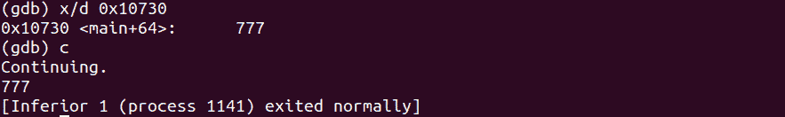

# 第 28 部分——破解整数变量

> 原文：<https://0xinfection.github.io/reversing/pages/part-28-hacking-integer-variables.html>

如需所有课程的完整目录，请点击下方，因为除了课程涵盖的主题之外，它还会为您提供每个课程的简介。[https://github . com/mytechnotalent/逆向工程-教程](https://github.com/mytechnotalent/Reverse-Engineering-Tutorial)

让我们回顾一下我们的代码。

我们黑吧！

我们再来看看 **0x10730** 的内存位置内部。

我们可以清楚地看到， **777** 的整数值出现，当我们继续时，它向终端回显与我们的 c++函数 **cout** 对应的 **777** 的值。

让我们破解 **0x10730** 内的值，并将该值设置为 **666** ，然后重新检查 **0x10730** 内的值并继续。

成功！正如我们可以看到的，我们将该值修改为 **666** ，当我们继续时，我们看到它被回显到 stdout。

下周我们将深入探讨浮点变量。