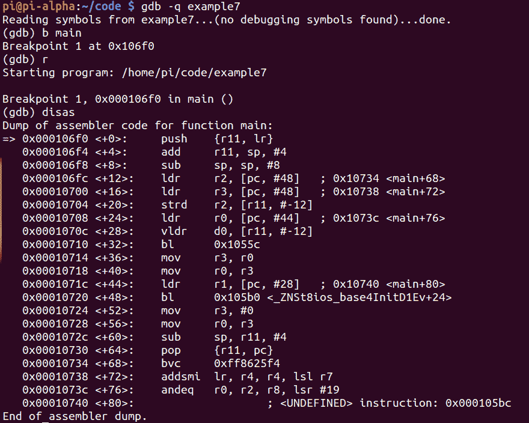
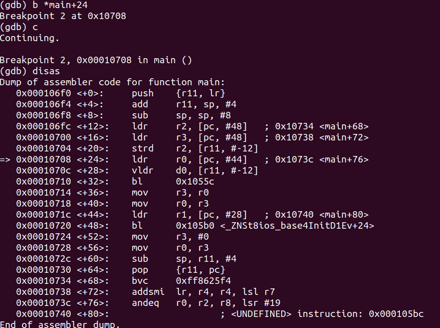
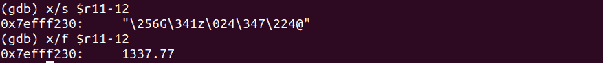
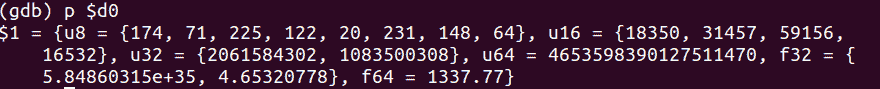
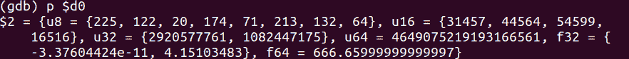
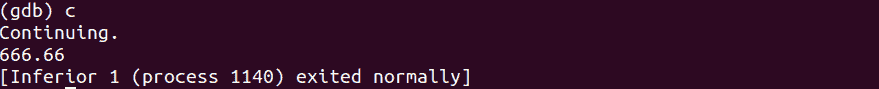

# 第 34 部分——破解双变量

> 原文：<https://0xinfection.github.io/reversing/pages/part-34-hacking-double-variables.html>

如需所有课程的完整目录，请点击下方，因为除了课程涵盖的主题之外，它还会为您提供每个课程的简介。[https://github . com/mytechnotalent/逆向工程-教程](https://github.com/mytechnotalent/Reverse-Engineering-Tutorial)

让我们回顾一下我们的代码。

```
int main(void) {

            double myNumber = 1337.77;

            std::cout << myNumber << std::endl;

            return 0;

}

```


我们来调试吧！



我们在 **main+24** 设置一个断点，继续。



我们看到了 **strd r2、【r11，#-12】**，我们必须完全理解这意味着我们正在将寄存器 **r11** 的 **-12** 偏移量处的值存储到 **r2** 中。现在让我们来看看到底是什么驻留在那里。



瞧啊。我们在那个偏移位置看到 **1337.77** 或者具体存储到内存中的 **0x7efff230** 中。


让我们进入执行 **vldr d0、【r11，#-12】**的两次，因为我们知道 **1337.77** 现在将被加载到双精度数学协处理器 **d0** 寄存器中。现在让我们打印下面那个位置的值。



让我们黑掉 **d0** 寄存器！


现在让我们重新检查一下 **d0** 里面的值。



我们继续。



成功黑了！

下周我们将深入研究 SizeOf 运算符。