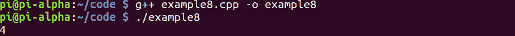

# 第 35 部分–SizeOf 运算符

> 原文:[https://0x infection . github . io/reversing/pages/part-35-sizeof-operator . html](https://0xinfection.github.io/reversing/pages/part-35-sizeof-operator.html)

如需所有课程的完整目录，请点击下方，因为除了课程涵盖的主题之外，它还会为您提供每个课程的简介。[https://github . com/mytechnotalent/逆向工程-教程](https://github.com/mytechnotalent/Reverse-Engineering-Tutorial)

我们旅程的下一个阶段是 SizeOf 运算符。

让我们检查一下我们的代码。

```
#include <iostream>

int main(void) {

            int myNumber = 16;

            int myNumberSize = sizeof(myNumber);

            std::cout << myNumberSize << std::endl;

            return 0;

}

```


要编译它，我们只需键入:

g++示例 8.cpp -o 示例 8

。/示例 8



我们看到 4 印在屏幕上。

让我们来分解一下:

我们创建了一个变量 **myNumber = 16** ，我们为其创建了另一个变量 **myNumberSize** ，它保存了 **myNumber** 的大小值。我们看到，当我们执行代码时，它显示 4，因此我们看到 SizeOf 操作符指示一个整数的宽度为 4 个字节。

下周我们将深入调试 SizeOf 操作符。