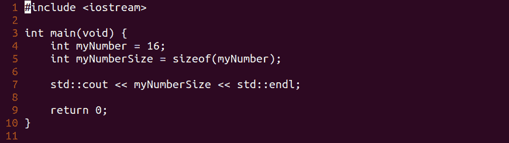
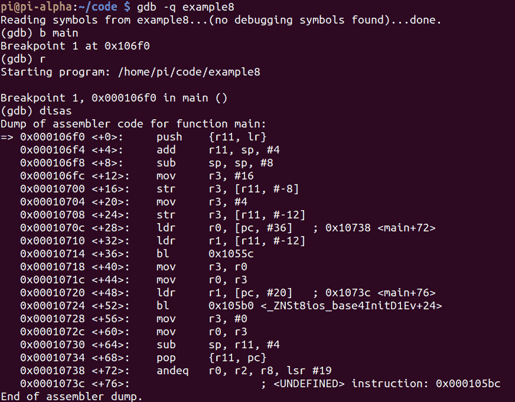
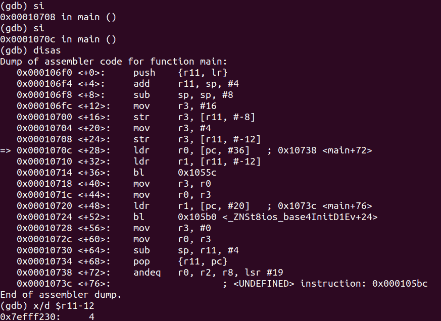

# 第 36 部分–调试 SizeOf 运算符

> 原文：<https://0xinfection.github.io/reversing/pages/part-36-debugging-sizeof-operator.html>

如需所有课程的完整目录，请点击下方，因为除了课程涵盖的主题之外，它还会为您提供每个课程的简介。[https://github . com/mytechnotalent/逆向工程-教程](https://github.com/mytechnotalent/Reverse-Engineering-Tutorial)

让我们重新检查我们的代码。

```
#include <iostream>

int main(void) {

            int myNumber = 16;

            int myNumberSize = sizeof(myNumber);

            std::cout << myNumberSize << std::endl;

            return 0;

}

```



请记住，我们创建了一个变量 **myNumber = 16** ，我们为其创建了另一个变量 **myNumberSize** ，它保存了 **myNumber** 的大小值。我们看到，当我们执行代码时，它显示 4，因此我们看到 SizeOf 操作符指示一个整数的宽度为 4 个字节。

让我们在 main 上调试和中断。



让我们中断 **main+20** ，因为我们可以看到 **4** 的值被移动到 **r3** 中。


让我们检查一下在 **main+16** 处发生了什么，因为我们可以看到我们正在将存在于 **r3** 中的数据存储到 **$r11-8** 的值中，在我们的例子中，r3 是 **16** 。这是有意义的，因为当我们检查我们的原始代码时， **myNumber** 的值实际上是 **16** 。当我们检查 **$r11-8** 中的值时，我们可以看到这一点。



正如我们在上面看到的， **$r11-12** 中的值是 **4** ，因为它代表了 **SizeOf** 返回的值，因为整数 **16** 实际上是 4 字节宽。


最后，当我们继续执行时，我们实际上看到值 **4** 回显到终端。

下周我们将深入探讨如何破解 SizeOf 运算符。