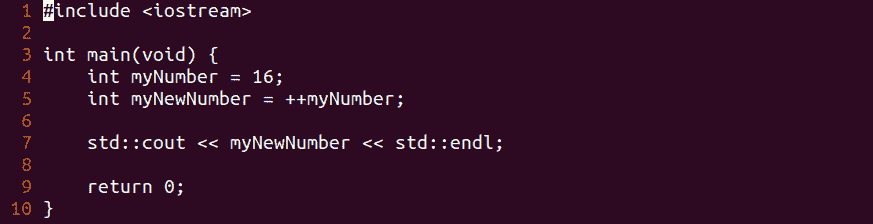

# 第 38 部分-前递增运算符

> 原文：<https://0xinfection.github.io/reversing/pages/part-38-pre-increment-operator.html>

如需所有课程的完整目录，请点击下方，因为除了课程涵盖的主题之外，它还会为您提供每个课程的简介。[https://github . com/mytechnotalent/逆向工程-教程](https://github.com/mytechnotalent/Reverse-Engineering-Tutorial)

我们旅程的下一个阶段是预递增运算符。

让我们检查一下我们的代码。

```
#include <iostream>

int main(void) {

            int myNumber = 16;

            int myNewNumber = ++myNumber;

            std::cout << myNewNumber << std::endl;

            return 0;

}

```



要编译它，我们只需键入:

g++示例 9.cpp -o 示例 9

。/示例 9


我们看到 17 印在屏幕上。

让我们来分解一下:

我们创建了一个变量 **myNumber = 16** ，并在此基础上创建了另一个变量 **myNewNumber** ，它预先增加了 **myNumber** 的值。我们看到，当我们执行代码时，它显示 17。

当我们进行预递增时，变量的值在赋给另一个变量之前是递增的。例如**我的号码**是 **16** ，所以它在被分配给**我的新号码**之前被递增，因此我们得到 **17** 。

下周我们将深入调试前增量操作符。