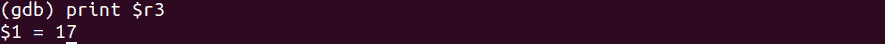

# 第 39 部分–调试预递增运算符

> 原文：<https://0xinfection.github.io/reversing/pages/part-39-debugging-pre-increment-operator.html>

如需所有课程的完整目录，请点击下方，因为除了课程涵盖的主题之外，它还会为您提供每个课程的简介。[https://github . com/mytechnotalent/逆向工程-教程](https://github.com/mytechnotalent/Reverse-Engineering-Tutorial)

让我们重新检查我们的代码。

```
#include <iostream>

int main(void) {

            int myNumber = 16;

            int myNewNumber = ++myNumber;

            std::cout << myNewNumber << std::endl;

            return 0;

}

```


要编译它，我们只需键入:

g++示例 9.cpp -o 示例 9

。/示例 9


我们看到 17 印在屏幕上。

让我们来分解一下:

我们创建了一个变量 **myNumber = 16** ，并在此基础上创建了另一个变量 **myNewNumber** ，它预先增加了 **myNumber** 的值。我们看到，当我们执行代码时，它显示 17。

当我们进行预递增时，变量的值在赋给另一个变量之前是递增的。例如**我的号码**是 **16** ，所以它在被分配给**我的新号码**之前被递增，因此我们得到 **17** 。

我们来调试一下。


我们通常在 gdb 开始，在 main 中断。请注意在 **main+24** 处，我们正在将 **1** 的值移入 **r3** 。然后，我们看到在 **main+28** 处，我们将该值存储在 **r11-8** 处，我们将为其设置一个断点并继续。


当我们在这个阶段评估 **r3** 中的值时，我们看到 **17** 。记得在我们的原始代码中， **myNumber** 变量中的值是 **16** 。我们可以看到，预递增运算符成功地递增了值 **1** ，得到了 **17** 。



我们看到，当我们继续通过代码时，值 **17** 如预期的那样成功地回显到终端。


下周我们将深入研究如何调试前增量操作符。