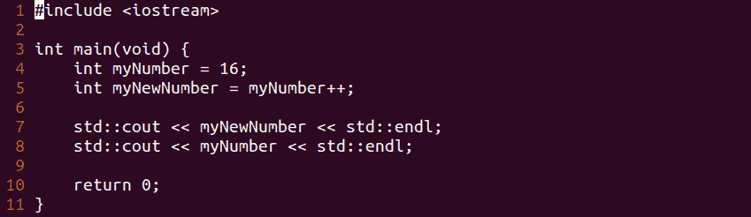
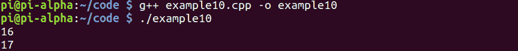

# 第 41 部分–后增量运算符

> 原文：<https://0xinfection.github.io/reversing/pages/part-41-post-increment-operator.html>

如需所有课程的完整目录，请点击下方，因为除了课程涵盖的主题之外，它还会为您提供每个课程的简介。[https://github . com/mytechnotalent/逆向工程-教程](https://github.com/mytechnotalent/Reverse-Engineering-Tutorial)

让我们深入我们的代码。

```
#include <iostream>

int main(void) {
    int myNumber = 16;
    int myNewNumber = ++myNumber;

    std::cout << myNewNumber << std::endl;

    return 0;
}

```



要编译它，我们只需键入:

g++示例 10.cpp -o 示例 10

。/示例 10



我们看到 16 和 17 印在屏幕上。

让我们来分解一下:

我们创建一个变量 **myNumber = 16** ，并在此基础上创建另一个变量 **myNewNumber** ，后者对 **myNumber** 的值进行后递增。我们看到，当我们执行我们的代码时，它将 **16** 显示为 **myNewNumber** 的值，将 **17** 显示为 **myNumber** 的值，将 **myNewNumber** 显示为 **myNumber** 没有递增，因为它是后操作符。

当我们后递增时，变量的值在赋给另一个变量后递增。例如**我的号码**是 **16** ，所以它在被分配给**我的新号码**后增加，所以我们得到 **17** 。

下周我们将深入调试后增量操作符。