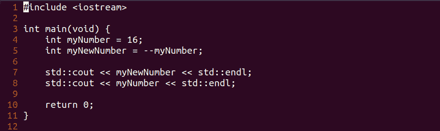
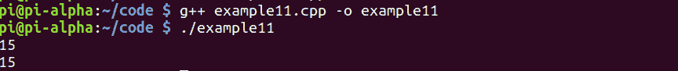

# 第 44 部分-预减量运算符

> 原文:[https://0x infection . github . io/reversing/pages/part-44-pre-decrement-operator . html](https://0xinfection.github.io/reversing/pages/part-44-pre-decrement-operator.html)

如需所有课程的完整目录，请点击下方，因为除了课程涵盖的主题之外，它还会为您提供每个课程的简介。[https://github . com/mytechnotalent/逆向工程-教程](https://github.com/mytechnotalent/Reverse-Engineering-Tutorial)

让我们看一下预减量操作符的例子。预递减运算符在分配操作之前递减给定值。

让我们检查一下我们的代码。

```
#include <iostream>

int main(void) {
    int myNumber = 16;
    int myNewNumber = --myNumber;

    std::cout << myNewNumber << std::endl;
    std::cout << myNumber << std::endl;

    return 0;
}

```



当我们编译和运行时，我们看到 15 回显到终端。



**myNumber** 的值是 **16** ，当它被赋予预递减运算符时，我们看到新值是 **15** ，因为它被赋予 **myNewNumber** 。

下周我们将深入探讨 Debuggin 预减量运算符。