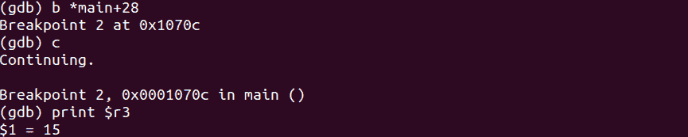
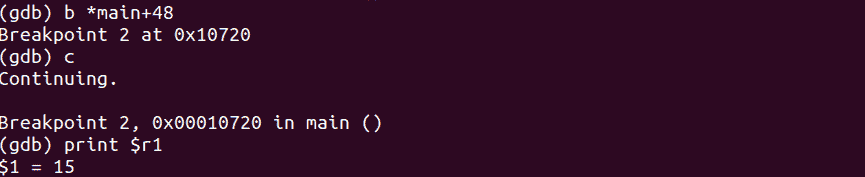
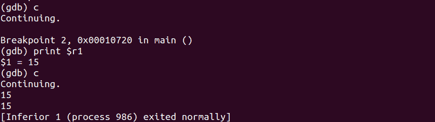

# 第 45 部分–调试预减量运算符

> 原文：<https://0xinfection.github.io/reversing/pages/part-45-debugging-pre-decrement-operator.html>

如需所有课程的完整目录，请点击下方，因为除了课程涵盖的主题之外，它还会为您提供每个课程的简介。[https://github . com/mytechnotalent/逆向工程-教程](https://github.com/mytechnotalent/Reverse-Engineering-Tutorial)

让我们重新检查我们的代码。

```
#include <iostream>

int main(void) {
    int myNumber = 16;
    int myNewNumber = --myNumber;

    std::cout << myNewNumber << std::endl;
    std::cout << myNumber << std::endl;

    return 0;
}

```

我们记得当我们编译的时候我们得到了 15。

我们来调试一下。


我们休息吧。



正如我们看到的, **r3** 持有 15。请记住，破解这个值可能不是它可能存储的最终位置。下周请记住这一点，并重新检查上面的调试代码，看看您是否能解决它。



正如我们可以看到的, **r1** 也有 15 个。请记住上面的陈述。



当我们继续时，我们看到我们的 **cout** 函数如预期的那样在两个区域都返回 15。

下周我们将深入探讨黑客预减量操作符。