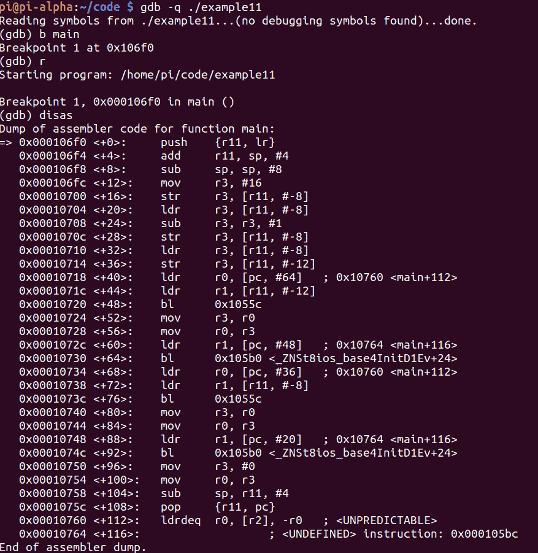
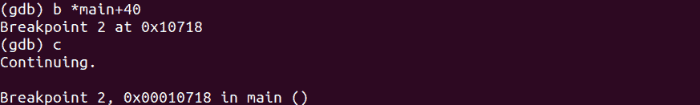
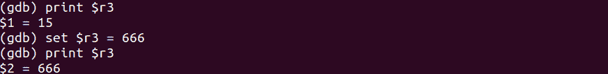
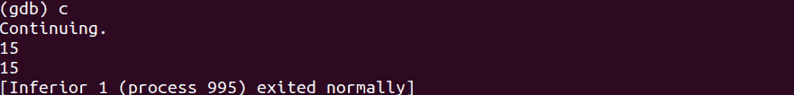
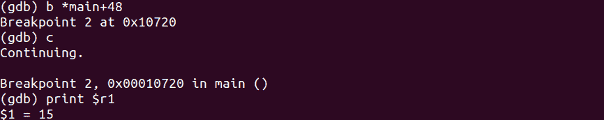
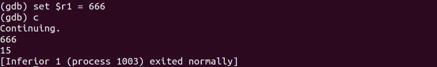

# 第 46 部分-黑客预减量运算符

> 原文：<https://0xinfection.github.io/reversing/pages/part-46-hacking-pre-decrement-operator.html>

如需所有课程的完整目录，请点击下方，因为除了课程涵盖的主题之外，它还会为您提供每个课程的简介。[https://github . com/mytechnotalent/逆向工程-教程](https://github.com/mytechnotalent/Reverse-Engineering-Tutorial)

让我们重新检查我们的代码。

```
#include <iostream>

int main(void) {
    int myNumber = 16;
    int myNewNumber = --myNumber;

    std::cout << myNewNumber << std::endl;
    std::cout << myNumber << std::endl;

    return 0;
}

```

我们记得当我们编译的时候我们得到了 15。

我们来调试一下。



我们休息吧。



我们来复习一下 **r3** 里面有什么，黑一下。



现在我们继续，我们看到它没有成功入侵，为什么？



我们重新运行二进制代码，然后中断并查看这里在 **r1** 保持 **15** 的值。



当我们继续时，我们看到 15 个我们不想要的。


现在我们再次中断并打印值。


这次我们设置了 **r1** ，我们可以看到我们已经成功入侵了！



这是你第一次真正打破记录，看到东西存放在哪里，以及它如何影响结果。花点时间自己运行它，这样你就能真正掌握它。

下周我们将深入探讨后减量运算符。