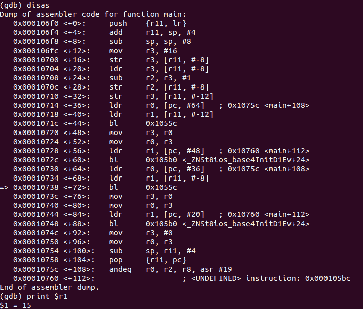

# 第 49 部分–破解后减量运算符

> 原文:[https://0x infection . github . io/reversing/pages/part-49-hacking-post-decrement-operator . html](https://0xinfection.github.io/reversing/pages/part-49-hacking-post-decrement-operator.html)

如需所有课程的完整目录，请点击下方，因为除了课程涵盖的主题之外，它还会为您提供每个课程的简介。[https://github . com/mytechnotalent/逆向工程-教程](https://github.com/mytechnotalent/Reverse-Engineering-Tutorial)

让我们再次回顾一下我们的代码。

```
#include <iostream>

int main(void) {
    int myNumber = 16;
    int myNewNumber = myNumber--;

    std::cout << myNewNumber << std::endl;
    std::cout << myNumber << std::endl;

    return 0;
}

```

让我们回顾一下上周的调试。



正如我们在这里看到的，在 **main+68** 的 **r1** 中的值是 **15** 。我们黑吧！


我们又一次操纵并改变了程序的执行，使之符合我们自己的意愿。通过每一节小课，您可以更好地理解处理器以及它如何与二进制文件交互。

希望这个系列给你一个了解 ARM 处理器的坚实框架。这个系列到此结束。感谢你们一路走来！