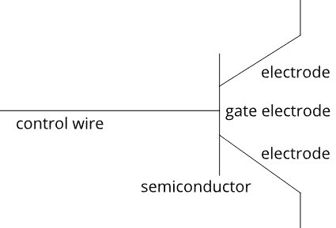

# 第 2 部分-晶体管

> 原文:[https://0x infection . github . io/reversing/pages/part-2-transistors . html](https://0xinfection.github.io/reversing/pages/part-2-transistors.html)

如需所有课程的完整目录，请点击下方，因为除了课程涵盖的主题之外，它还会为您提供每个课程的简介。[https://github . com/mytechnotalent/逆向工程-教程](https://github.com/mytechnotalent/Reverse-Engineering-Tutorial)

为了理解现代计算，我们必须深入到最基础的层面。我们的旅程从晶体管开始。

晶体管只不过是一个复杂的继电器，因为它是一个开关，可以通过施加电荷来打开或关闭。这种充电是通过使用控制线来实现的。控制线附着在可以导电或抗电的材料上，在控制线的另一端有两个电极附着在这种材料上。这是半导体的概念。控制线连接到栅电极，如果你改变栅极的电荷，就可以控制半导体材料的导电性。想象一个简单的厨房水龙头，你可以打开或关闭水。概念挺像的。

很简单，电流表示 1，没有电流表示 0。这是一个 boolean on 或 off 架构，我们需要在以后更深入地研究二进制数字系统。

我有意让这些课程简短，以便吸引最多的观众每周花几分钟来正确掌握一些复杂的架构。

下周我们将触及逻辑门，并讨论这些门的组合如何构成处理器工作的核心。我们将只在高层次上讨论它们，因为这将是电气工程中的一门额外课程，以真正了解处理器是如何制造的，我们将坚持基础知识，并将更多时间花在如何对芯片编程上。

在了解了处理器的一些基础知识以及二进制和十六进制数字系统之后，我们将构建我们自己的可引导操作系统。