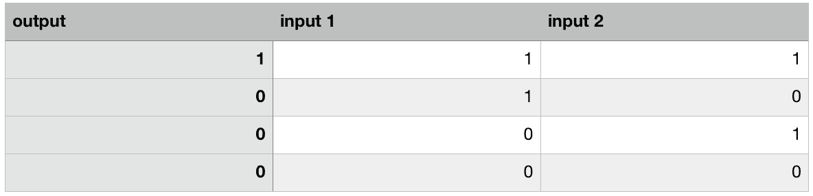
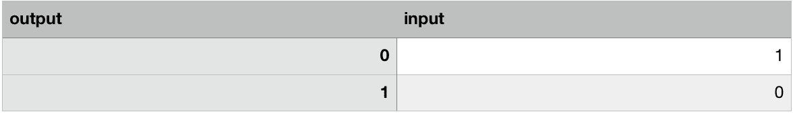
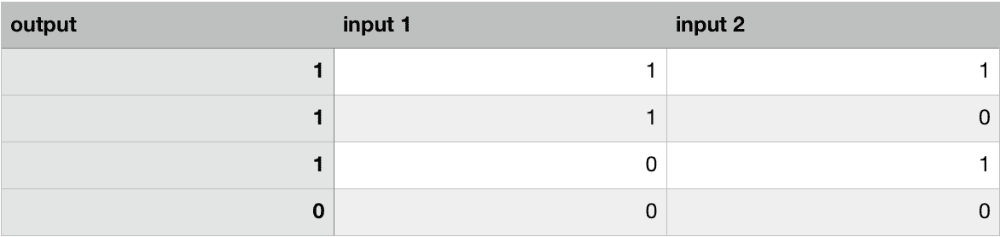
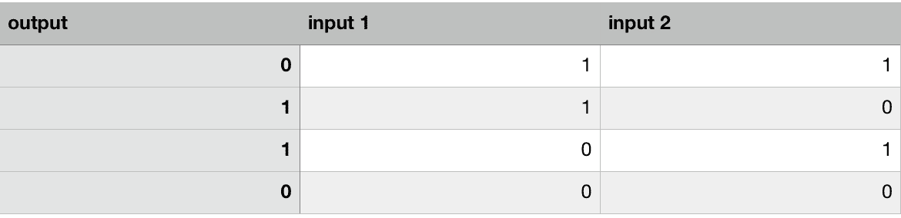

# 第 3 部分-逻辑门

> 原文:[https://0x infection . github . io/reversing/pages/part-3-logic-gates . html](https://0xinfection.github.io/reversing/pages/part-3-logic-gates.html)

如需所有课程的完整目录，请点击下方，因为除了课程涵盖的主题之外，它还会为您提供每个课程的简介。[https://github . com/mytechnotalent/逆向工程-教程](https://github.com/mytechnotalent/Reverse-Engineering-Tutorial)

在上一个教程中，我们简要地讨论了二进制，我们用真或假来表示它。在二进制中，true 等于 1，false 等于 0。计算机最终是建立在这个非常简单的概念上的，这个概念的核心是我们有四个可能的逻辑门，它们可以以无限多的序列组合在一起。

下面就从**和**门开始吧。

在与门中有两个二进制值，只有当两个二进制值都为 1 时，与门才输出 1。

**非门**如下图所示。

在“非”门里，它只取一个二进制值，然后对其求反。

**或门**如下图所示。

在“或”门中，只有一个输入必须为 1 才能输出 1。

**异或门**如下图所示。

在异或门中，如果两个输入都为 0 或 1，则输出为 0。

“那为什么……”好吧，那我为什么要重复这个？这跟懂组装或者逆向工程有什么关系？良好的...所有处理器的核心都是这些简单的逻辑门，当它们组合在一起形成复杂的指令。我可以花上几年的时间在实践中向你展示这一点，但是我会把它留给其他人去完成。重要的是，当我们在汇编中编码时，更重要的是当我们进行逆向工程时，当我们最终看到诸如 AND、OR、XOR 等指令时，您对这里发生的事情有了基本的理解。

敬请期待！我们将很快建立我们自己的非常简单的操作系统！