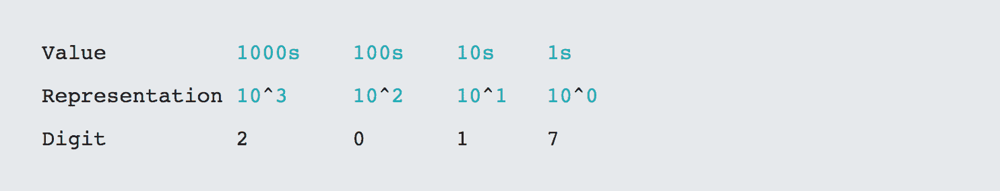
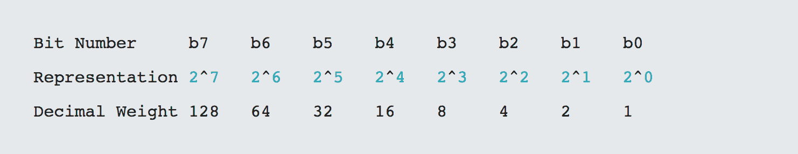
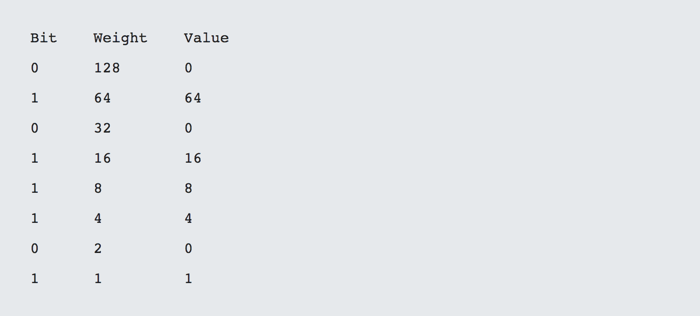
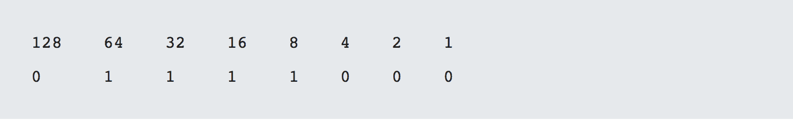
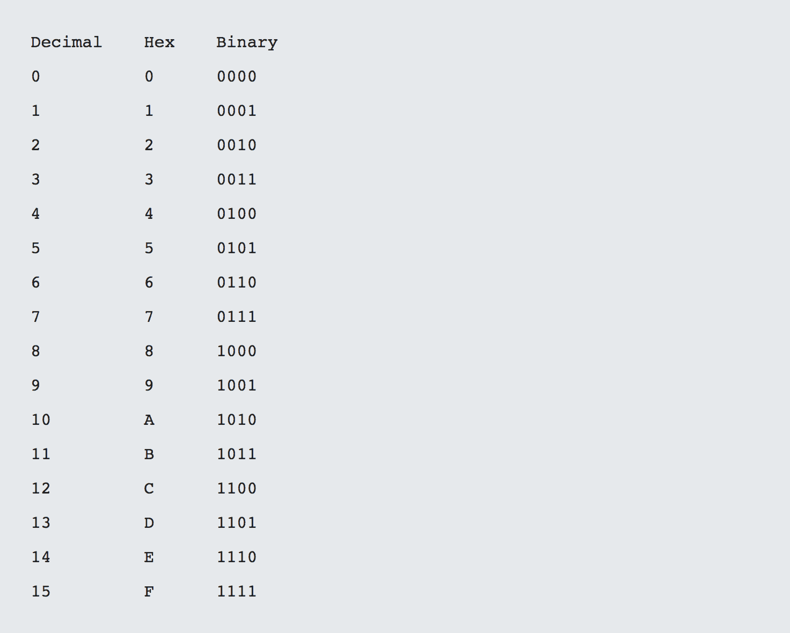
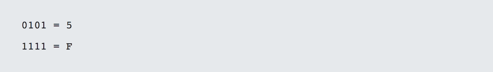
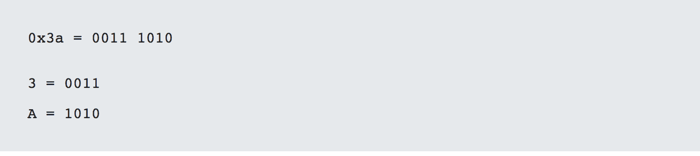
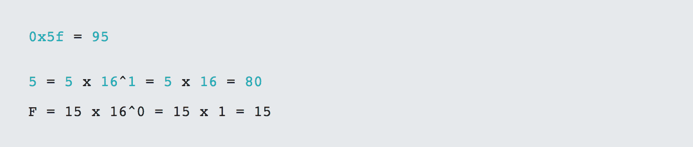

# 第 4 部分-数字系统

> 原文:[https://0x infection . github . io/reversing/pages/part-4-number-systems . html](https://0xinfection.github.io/reversing/pages/part-4-number-systems.html)

如需所有课程的完整目录，请点击下方，因为除了课程涵盖的主题之外，它还会为您提供每个课程的简介。[https://github . com/mytechnotalent/逆向工程-教程](https://github.com/mytechnotalent/Reverse-Engineering-Tutorial)

真的都分解成 1 和 0 了。无论未来的框架发展得多么复杂，它们都包括解释语言，最终使用 JVM 或类似的东西，然后是汇编、机器码和二进制代码。

为什么我们需要谈论数系呢？为什么它与我们这里的系列相关？答案很简单。除了 1 和 0 以外，指令和内存以及处理器寄存器都使用另一种称为十六进制的数字系统。

我们来讨论二进制！微处理器的核心是一系列二进制数，它们是+5V(开或 1)或 0V(关或 0)。每个 0 或 1 代表微处理器中的一位信息。8 位的组合形成一个字节。

在我们深入研究二进制之前，让我们先检查一下熟悉的十进制。如果我们取 2017 这个数字，我们会理解为 2017 年。

让我们来看看二进制系统和它如何运行的基础知识。

如果我们要把一个二进制数转换成十进制数，我们只需简单地做以下事情。让我们取一个二进制数 0101101，如你所见，它是十进制的 93。

将“值”列中的值相加得到十进制数 0 + 64 + 0 + 16 + 8 + 4 + 0 + 1 = 93。

如果我们要将一个十进制数转换成二进制数，我们将检查是否可以相对于最高位进行减法运算，如果可以，则将 1 放入二进制列，余数将被带入下一行。让我们考虑十进制值 120 的例子，它是 0111 1000 二进制。

1)128 能放在 120 里面吗:不能，所以是 0。

2)120 里面能装下 64 吗:能，所以 1，那么 120–64 = 56。

3)32 能装进 56 吗:是的，所以是 1，那么 56–32 = 24。

4)16 能装进 24 吗:是的，所以是 1，那么 24–16 = 8。

5)8 能装进 8 吗:是的，所以是 1，那么 8–8 = 0。

6)4 能放在 0 里面吗:不能，所以 0。

7)2 能放在 0 里面吗:不能，所以 0。

8)1 能放在 0 里面吗:不能，所以 0。

当我们想将二进制转换为十六进制时，我们只需使用下表。

让我们将二进制数(如 0101 1111)转换为十六进制数。要做到这一点，我们只需查看表格并比较由 4 位组合而成的每个半字节。请记住，8 位等于一个字节，2 个半字节等于一个字节。

因此 0101 1111 二进制= 0x5f 十六进制。0x 符号表示十六进制。

从十六进制到二进制非常简单，因为你只需做相反的事情，比如:

理解每个十六进制数字的长度是一个半字节很重要，因此两个十六进制数字的长度是一个字节。

要将十六进制转换为十进制，我们需要执行以下操作:

因此，我们可以看到，80 + 15 = 95 是 0x5f 十六进制。

最后将十进制转换成十六进制。让我们取十进制数 850，也就是十六进制数 352。

“当计算机为我做这些的时候，我为什么要浪费时间去学这些垃圾！”

正如我上面提到的，如果你想真正掌握逆向工程的核心，那么很好地理解这两个额外的数字系统是至关重要的。有一些很棒的工具可以帮助你重新开始，但是当你成长的时候，更好的理解这些工具会帮助你。

我不是建议你记住上面的内容，也不是建议你每个都做一千个例子。我所要求的是，你要花时间真正理解字面上的一切，我的意思是一切都归结于处理器中的二进制位。

无论你是创建、调试还是破解一个汇编、Python、Java、C、C++、R、JavaScript 或任何其他流行的新语言应用程序，最终一切都必须归结为二进制 0 和 1，它们代表+5V 或 0V。

我们人类使用十进制系统。让我们把思维扩展到以 2 为基数的二进制和以 16 为基数的十六进制！

下周我们将深入学习二进制加法！敬请期待！