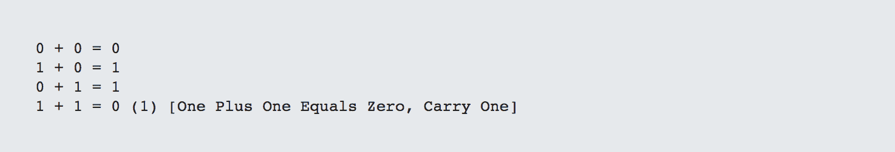
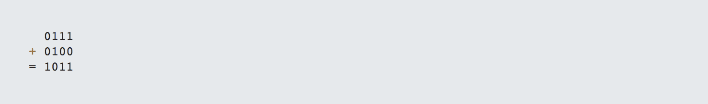
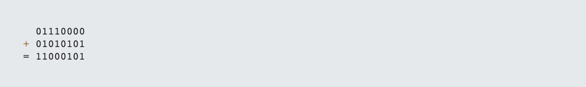
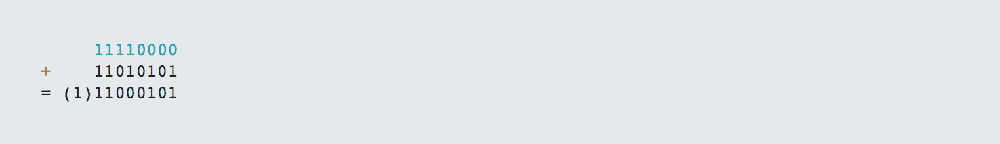

# 第 5 部分-二进制加法

> 原文:[https://0x infection . github . io/reversing/pages/part-5-binary-addition . html](https://0xinfection.github.io/reversing/pages/part-5-binary-addition.html)

如需所有课程的完整目录，请点击下方，因为除了课程涵盖的主题之外，它还会为您提供每个课程的简介。[https://github . com/mytechnotalent/逆向工程-教程](https://github.com/mytechnotalent/Reverse-Engineering-Tutorial)

二进制加法有四种不同的方式:

请记住,( 1)表示进位。它很简单地意味着溢出。

让我们以下面的 4 位半字节为例:

我们在第三位看到一个明显的进位。如果第 8 位有一个进位，那么这将在 CPU 内产生一个进位标志。

让我们检查一个 8 位数字:

如果我们有:

这里我们看到一个进位位，它将触发 CPU 中的进位标志为 1 或真。我们将在后面的教程中讨论进位标志。请记住这个例子作为参考，因为理解它非常重要。

下周我们将深入学习二进制减法！敬请期待！