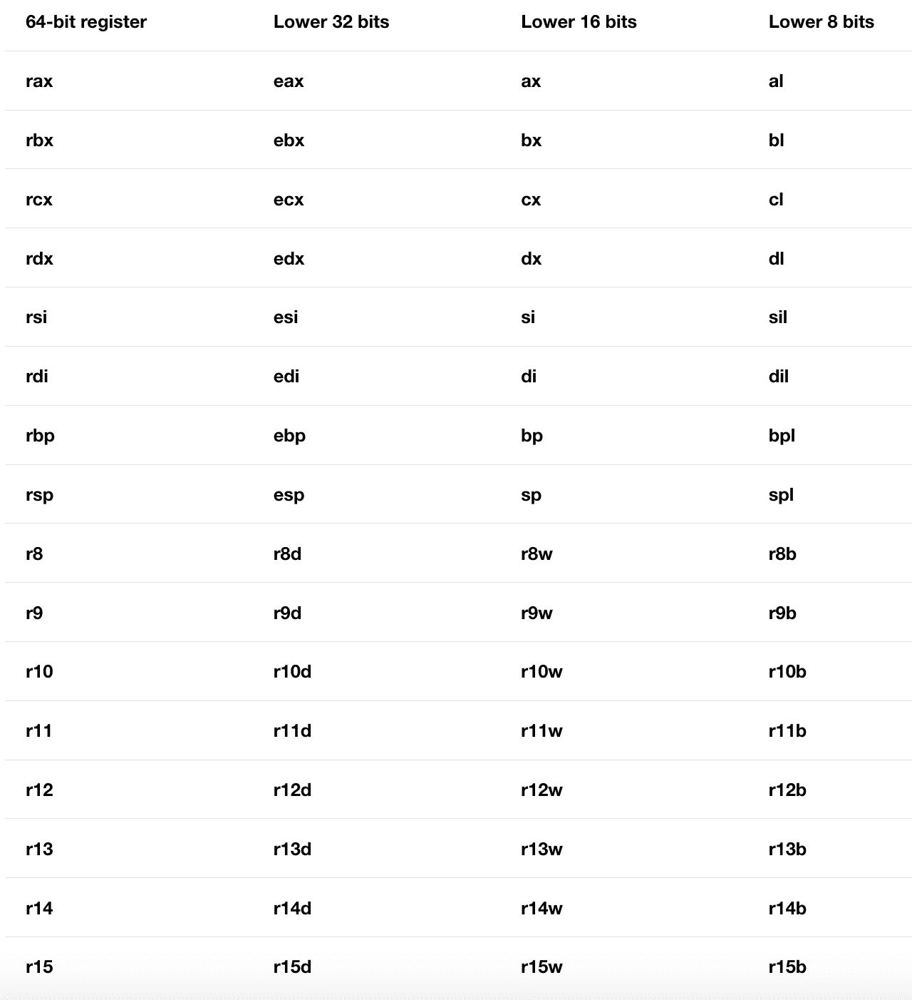

# 第 8 部分-总体架构

> 原文:[https://0x infection . github . io/reversing/pages/part-8-general-architecture . html](https://0xinfection.github.io/reversing/pages/part-8-general-architecture.html)

如需所有课程的完整目录，请点击下方，因为除了课程涵盖的主题之外，它还会为您提供每个课程的简介。[https://github . com/mytechnotalent/逆向工程-教程](https://github.com/mytechnotalent/Reverse-Engineering-Tutorial)

x64 架构是 x86 平台的向后兼容扩展。它提供了与 x86 相同的传统 32 位模式和新的 64 位模式。如果你想在 LinkedIn 上获得更多信息，你可以回顾我的传统 x86 教程。

术语“x64”包括 AMD 64 和 Intel64。指令集是相似的。

x64 将 x86 的 8 个通用寄存器扩展为 64 位，并添加了 8 个新的 64 位寄存器。64 位寄存器的名字以“ **r** 开头，所以例如 **eax** 的 64 位扩展被称为 **rax** 。新寄存器被命名为 **r8** 至 **r15** 。

每个寄存器的低 32 位、16 位和 8 位可在操作数中直接寻址。这包括寄存器，如 **esi** ，其低 8 位之前不可寻址。下表指定了 64 位寄存器低位部分的汇编语言名称。

下表列出了每个字节的区别。

输出到 32 位子寄存器的操作自动零扩展到整个 64 位寄存器。输出到 8 位或 16 位子寄存器的操作是*而不是*零扩展的(这是兼容的 x86 行为)。

**ax** 、 **bx** 、 **cx** 和 **dx** 的高 8 位仍可寻址为 **ah** 、 **bh** 、 **ch** 、 **dh** ，但不能用于所有类型的操作数。

指令指针、 **eip** 和**标志**寄存器也被扩展到 64 位(分别为 **rip** 和 **rflags** )。

x64 处理器还提供了几组浮点寄存器:

*   八个 80 位 x87 寄存器。
*   八个 64 位 MMX 寄存器。(这些与 x87 寄存器重叠。)
*   原来的 8 个 128 位 SSE 寄存器增加到 16 个。

下周我们将深入讨论电话会议！敬请期待！