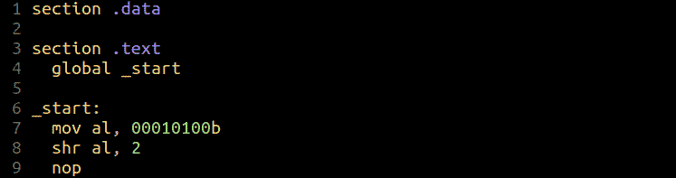
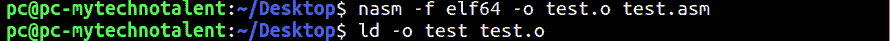
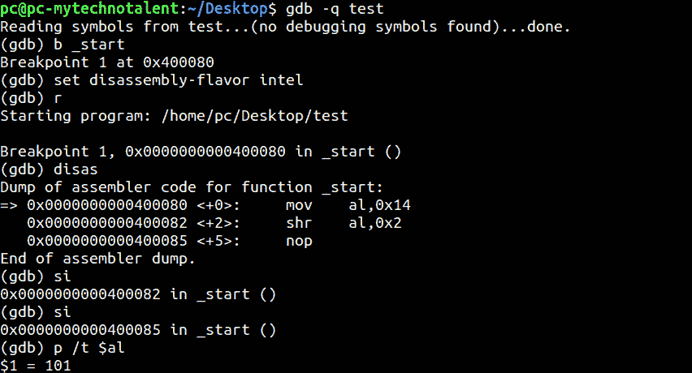

# 第 15 部分- SHR 说明

> 原文：<https://0xinfection.github.io/reversing/pages/part-15-shr-instruction.html>

如需所有课程的完整目录，请点击下方，因为除了课程涵盖的主题之外，它还会为您提供每个课程的简介。[https://github . com/mytechnotalent/逆向工程-教程](https://github.com/mytechnotalent/Reverse-Engineering-Tutorial)

SHR 命令代表右移。

让我们假设寄存器**a1**保存 00010100b，这是一个 8 位二进制值。假设指令是 **shr al，2** 。下面是我们看到值向左移动两位时发生的情况。

 00010100

00010100

00000101

下周我们将潜入 ROL！敬请期待！